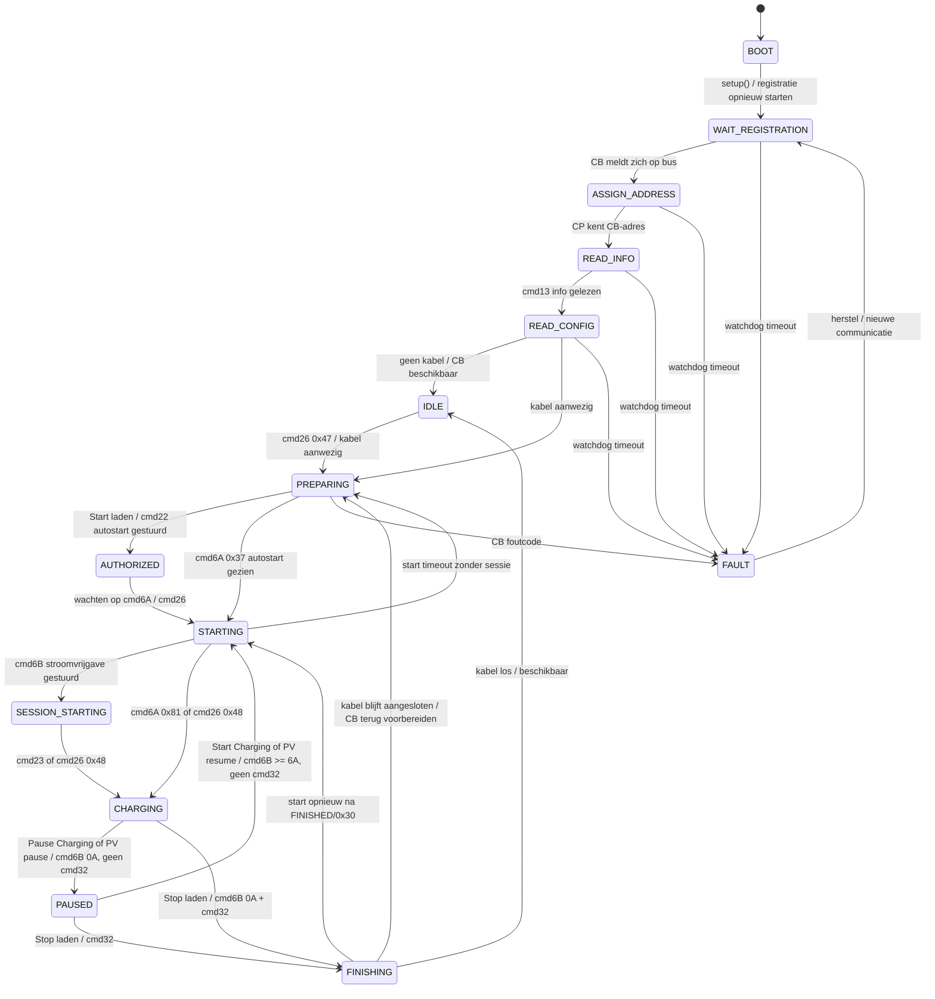
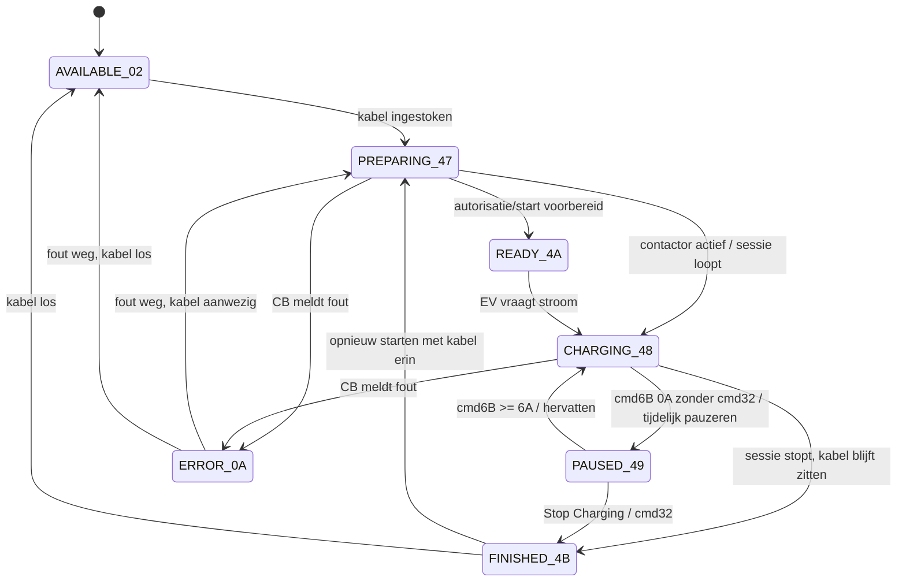
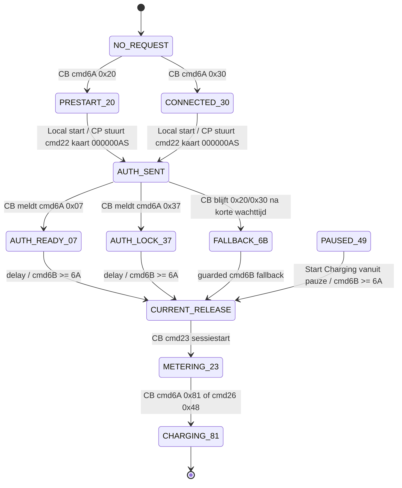
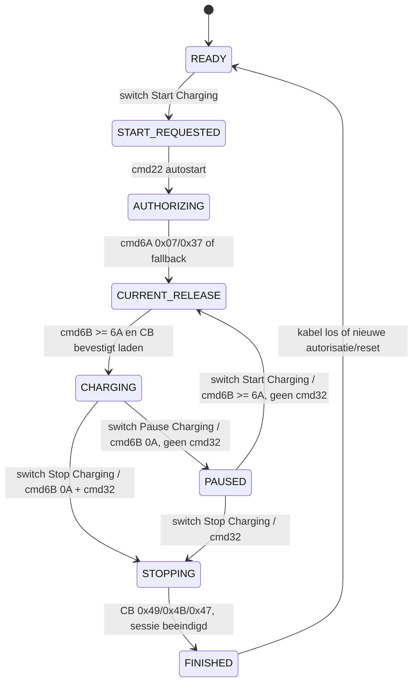
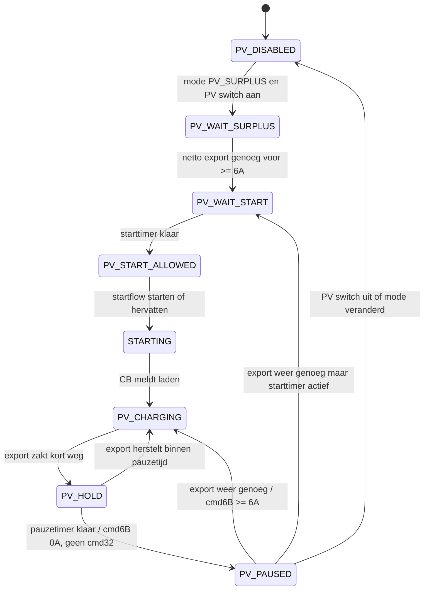
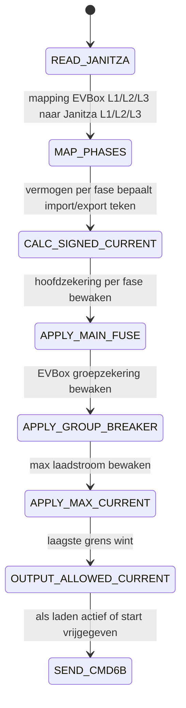
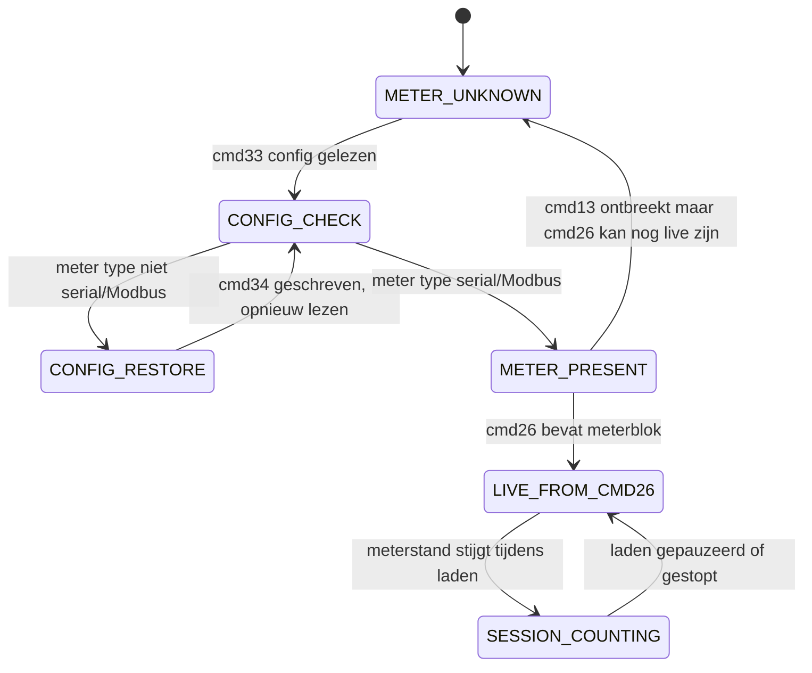
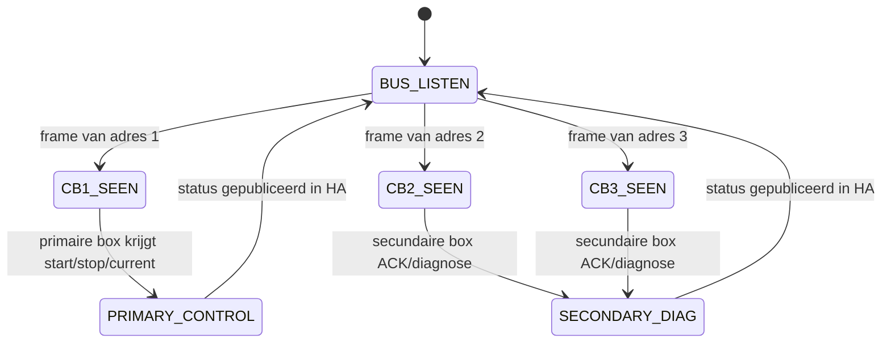
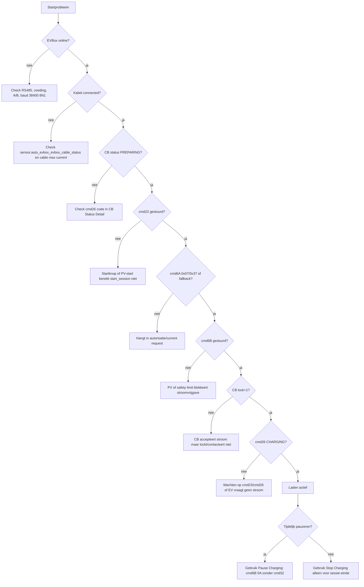

# EVBox MAX ESP32 state machines en Home Assistant variabelen

Versie: v0.3.0 pauze/herstart diagnose  
Component pin in ESPHome YAML: `3cb7b873fe0ae274df45fba5aed1c7f430c5e370`  
Device in Home Assistant: `auto_evbox`

Dit document koppelt de software-state, de EVBox ChargeBox codes en de Home Assistant entiteiten. Gebruik dit als diagnoseblad wanneer laden, pauzeren, kWh-meter of load balancing blijft hangen.

Belangrijkste HA-entiteiten:

| Wat | HA entiteit |
| --- | --- |
| Onze ESP/controller state machine | `sensor.auto_evbox_evbox_state` |
| Menselijke samenvatting | `sensor.auto_evbox_evbox_status` |
| EVBox ChargeBox `cmd26` status | `sensor.auto_evbox_evbox_cb_status_detail` |
| EVBox ChargeBox `cmd6A` request | `sensor.auto_evbox_evbox_current_request_state` |
| Kabelstatus | `sensor.auto_evbox_evbox_cable_status` |
| Kabel maximale stroom | `sensor.auto_evbox_evbox_cable_max_current` |
| Lock status tekst | `sensor.auto_evbox_evbox_lock_status` |
| Lock status ruwe waarde | `sensor.auto_evbox_evbox_cb_lock_state` |
| CB zegt dat hij laadt | `sensor.auto_evbox_evbox_cb_is_charging` |
| Door ESP naar CB gestuurd | `sensor.auto_evbox_evbox_commanded_current` |
| Door CB teruggemeld | `sensor.auto_evbox_evbox_returned_current_limit` |
| Werkelijke EV stroom | `sensor.auto_evbox_evbox_current` |
| Start laden | `switch.auto_evbox_start_charging` |
| Pauze laden zonder sessie-einde | `switch.auto_evbox_pause_charging` |
| Stop laden / sessie beeindigen | `switch.auto_evbox_stop_charging` |
| PV-regelstatus | `sensor.auto_evbox_evbox_pv_status` |
| Begrenzingsreden | `sensor.auto_evbox_evbox_limit_reason` |
| Meterstatus | `sensor.auto_evbox_evbox_meter_status` |
| Meterstand | `sensor.auto_evbox_evbox_meter_value` |

## Pagina 1 - Hoofdstate machine van de ESP/controller

Deze state machine is de softwarematige toestand van de ESPHome component. Dit zie je direct in:

`sensor.auto_evbox_evbox_state`

Statewaarden:

| ESP state | Betekenis | Verwachte HA-checks |
| --- | --- | --- |
| `BOOT` | Component start op | kort zichtbaar |
| `WAIT_REGISTRATION` | Wachten tot CB zich meldt | `sensor.auto_evbox_evbox_communication` |
| `ASSIGN_ADDRESS` | ESP wijst CB-adres toe | `sensor.auto_evbox_evbox_cb_serial` |
| `READ_INFO` | Leest CB/meter info | `sensor.auto_evbox_evbox_meter_model`, `sensor.auto_evbox_evbox_meter_serial` |
| `READ_CONFIG` | Leest CB-configuratie | logregels `cmd33`, `cmd34` |
| `IDLE` | Klaar, geen actieve kabel/start | `sensor.auto_evbox_evbox_status` = Ready |
| `PREPARING` | Kabel aanwezig, wacht op start/autorisatie | `sensor.auto_evbox_evbox_cable_status` |
| `AUTHORIZED` | `cmd22` autostart is gestuurd of geaccepteerd | logregel `cmd22 autostart authorization` |
| `STARTING` | Start loopt, wacht op lock/stroom/sessie | `sensor.auto_evbox_evbox_current_request_state` |
| `SESSION_STARTING` | Stroom is vrijgegeven, sessie nog niet bewezen actief | `sensor.auto_evbox_evbox_commanded_current` |
| `CHARGING` | CB meldt laden | `sensor.auto_evbox_evbox_cb_is_charging` = 1 |
| `PAUSED` | Zachte pauze: stroomvrijgave 0A, geen `cmd32`; stekker en sessie blijven herstelbaar | `switch.auto_evbox_pause_charging`, `sensor.auto_evbox_evbox_pv_status` |
| `FINISHING` | Harde stop: sessie afbouwen met `cmd32` | `switch.auto_evbox_stop_charging` |
| `FAULT` | Fout of watchdog | `sensor.auto_evbox_evbox_status` = Fault |

## Pagina 2 - EVBox ChargeBox `cmd26` status machine

Dit is de toestand die de EVBox ChargeBox zelf meldt via `cmd26`. Dit zie je in:

`sensor.auto_evbox_evbox_cb_status_detail`

Bekende codes in de huidige software:

| `cmd26` code | Naam in HA | Betekenis voor diagnose |
| --- | --- | --- |
| `0x02` | `AVAILABLE 0x02` | CB beschikbaar, normaal geen kabel/start |
| `0x0A` | `ERROR_OR_FAULT 0x0A` | Fout of speciale G3-status; context nodig |
| `0x17` | `IN_USE_OR_PLUGGED 0x17` | In gebruik of ingeplugd, afhankelijk van fase |
| `0x47` | `PREPARING 0x47` | Kabel aanwezig, nog niet ladend |
| `0x48` | `CHARGING 0x48` | Laden actief, lock en contactor meestal actief |
| `0x49` | `PAUSED 0x49` | Laden gepauzeerd |
| `0x4A` | `READY 0x4A` | Klaar voor laadfase |
| `0x4B` | `FINISHED_PLUGGED_IN 0x4B` | Sessie klaar, kabel zit nog in de EVBox |
| onbekend | `UNKNOWN` | Ruwe log nodig |

Bij jouw bekende hangpunt stond dit zo:

| Signaal | Waarde |
| --- | --- |
| `sensor.auto_evbox_evbox_cb_status_detail` | `PREPARING 0x47` |
| `sensor.auto_evbox_evbox_current_request_state` | `OBSERVED_PRESTART_20 0x20` |
| `sensor.auto_evbox_evbox_lock_status` | `UNLOCKED` |
| `sensor.auto_evbox_evbox_commanded_current` | `0.0 A` |

Dat betekent: kabel gezien, maar start/lock/stroomvrijgave nog niet rond.

## Pagina 3 - EVBox `cmd6A` current request en start-handshake

Dit is de belangrijkste startdiagnose. De CB vraagt of meldt via `cmd6A`; de ESP antwoordt eerst met ACK en stuurt pas daarna op het juiste moment `cmd6B`.

HA-entiteit:

`sensor.auto_evbox_evbox_current_request_state`

Belangrijke `cmd6A` codes:

| `cmd6A` code | Naam in HA | Actie van ESP |
| --- | --- | --- |
| geen | `NO_REQUEST` | Nog geen actuele CB request gezien |
| `0x00` | `WAITING_FOR_CMD26` | ACK, status afwachten |
| `0x01` | `CHARGING_ACTIVE_G2` | Sessie actief behandelen |
| `0x07` | `AUTHORIZED_READY_G2` | Mag startvrijgave voorbereiden |
| `0x20` | `OBSERVED_PRESTART_20` | ACK; bij start eerst `cmd22`, daarna fallback mogelijk |
| `0x28` | `OBSERVED_PRESTART_28` | ACK; diagnostisch pre-start signaal |
| `0x2F` | `OBSERVED_PRESTART_2F` | ACK; diagnostisch pre-start signaal |
| `0x30` | `CONNECTED_WAITING` | Kabel/startwachtstand |
| `0x37` | `AUTHORIZED_WAIT_LOCK` | Startvrijgave plannen |
| `0x77` | `OBSERVED_READY_77` | Niet automatisch vrijgeven |
| `0x80` | `UNPLUGGED` | Start resetten |
| `0x81` | `CHARGING` | Laden actief |
| `0xA0` | `AVAILABLE` | Terug naar beschikbaar |
| `0xA7` | `READY` | Klaar/ready, G3-context nodig |
| `0xC1` | `FINISHED` | Sessie klaar |
| `0xE7` | `FAILED` | Fout |

Startvolgorde die we nu willen zien in de log:

1. `cmd26 PREPARING 0x47`, kabel > 0A.
2. Handmatige start of PV-start zet `sensor.auto_evbox_evbox_state` op `AUTHORIZED` of `STARTING`.
3. ESP stuurt `cmd22` met kaart `000000AS`.
4. Ideaal: CB stuurt `cmd6A 0x07` of `0x37`.
5. Daarna ESP stuurt `cmd6B`.
6. Als stap 4 niet komt: ESP probeert `guarded cmd6B fallback`.
7. Succes is bewezen door `cmd23` of `cmd26 0x48`.

## Pagina 4 - Handmatig starten, stoppen en pauzeren

Bediening in HA:

| Actie | HA entiteit |
| --- | --- |
| Modus kiezen | `select.auto_evbox_charge_mode` |
| Start laden | `switch.auto_evbox_start_charging` |
| Pauze laden zonder sessie-einde | `switch.auto_evbox_pause_charging` |
| Stop laden | `switch.auto_evbox_stop_charging` |
| Handmatige laadstroom | `number.auto_evbox_manual_current` |
| Maximale laadstroom | `number.auto_evbox_max_current` |
| EVBox groepzekering | `number.auto_evbox_evbox_group_breaker_current` |
| Hoofdzekering | `number.auto_evbox_main_fuse_current` |
| Failsafe mode | `select.auto_evbox_failsafe_mode` |
| Failsafe stroom | `number.auto_evbox_failsafe_current` |

Regels:

| Situatie | Wat doet de ESP |
| --- | --- |
| Start in `MANUAL` | Vraagt `manual_current`, begrensd door `max_current`, groepzekering, hoofdzekering en Janitza |
| Pauze tijdens laden | Stuurt alleen `cmd6B 0A`; geen `cmd32`; dit is de normale tijdelijke onderbreking |
| Hervatten na pauze | Stuurt opnieuw `cmd6B >= 6A`; geen nieuwe harde stop |
| Stop tijdens laden | Stuurt eerst `cmd6B 0A`, daarna `cmd32`; dit beeindigt de sessie |
| Pauze zonder stekker eruit | Gebruik `switch.auto_evbox_pause_charging`, niet `switch.auto_evbox_stop_charging` |
| Lager dan 6A gevraagd | Niet als laadstroom sturen; 0A betekent pauze |
| Tussen 0A en 6A | Wordt als 0A/suspend behandeld, omdat AC laden minimaal 6A vraagt |

Diagnose in HA:

| Vraag | Kijk naar |
| --- | --- |
| Heeft de knop gewerkt? | `sensor.auto_evbox_evbox_status` |
| Is de startflow actief? | `sensor.auto_evbox_evbox_state` |
| Heeft de ESP stroom gestuurd? | `sensor.auto_evbox_evbox_commanded_current` |
| Heeft de CB die stroom terug gemeld? | `sensor.auto_evbox_evbox_returned_current_limit` |
| Loopt er echt stroom? | `sensor.auto_evbox_evbox_current` |
| Is de kabel gelocked? | `sensor.auto_evbox_evbox_lock_status` |

## Pagina 5 - PV-surplus state machine

PV-surplus gebruikt totaal actief vermogen van de Janitza. Negatief totaalvermogen betekent netto teruglevering. Daarbovenop blijft de load balancing per fase actief.

Hoofd-HA-entiteiten:

| Wat | HA entiteit |
| --- | --- |
| PV mode aan/uit | `switch.auto_evbox_enable_pv_mode` |
| Modus | `select.auto_evbox_charge_mode` |
| PV status | `sensor.auto_evbox_evbox_pv_status` |
| Begrenzingsreden | `sensor.auto_evbox_evbox_limit_reason` |
| PV beschikbare stroom | `sensor.auto_evbox_evbox_pv_available_current` |
| PV starttimer | `sensor.auto_evbox_evbox_pv_start_timer` |
| PV pauzetimer | `sensor.auto_evbox_evbox_pv_pause_timer` |
| Janitza totaalvermogen | `sensor.auto_evbox_janitza_total_power` |
| Janitza import/export | `sensor.auto_evbox_janitza_import_power`, `sensor.auto_evbox_janitza_export_power` |

PV-statuswaarden die je kunt tegenkomen:

| PV status | Betekenis |
| --- | --- |
| `PV_DISABLED` | PV-regeling staat uit |
| `PV_WAIT_SURPLUS` | Wacht op voldoende negatief totaalvermogen |
| `PV_WAIT_START` | Er is genoeg surplus, starttimer loopt |
| `PV_START_ALLOWED` | PV mag laden starten/hervatten |
| `PV_CHARGING` | PV-regeling laat laden toe |
| `PV_PAUSED` | PV-regeling heeft laden tijdelijk op 0A gezet |
| `IDLE` | Geen actieve PV-beslissing |

Belangrijke regel: PV-pauze gebruikt dezelfde zachte pauze als de knop `Pause Charging`. De software hoort dus `cmd6B 0A` te sturen zonder `cmd32`. `Stop Charging` is voor bewust sessie-einde, niet voor PV-surplus regelen.

Begrenzingsredenen:

| Limit reason | Betekenis |
| --- | --- |
| `PV_BELOW_6A` | PV-stroom onder minimale AC-laadgrens |
| `PV_BELOW_6A_PAUSED` | Gepauzeerd omdat PV onder 6A bleef |
| `PV_START_DELAY` | Starttimer loopt |
| `PV_SURPLUS` | PV-surplus is voldoende |
| `PV_SWITCH_OFF` | PV schakelaar staat uit |
| `SAFETY_LIMIT` | Begrensd door zekering/load balancing |
| `UNKNOWN` | Nog geen geldige regelbeslissing |

## Pagina 6 - Load balancing per fase

Load balancing gebruikt Janitza stromen plus getekend vermogen per fase. De EVBox-fasen kunnen in HA worden gemapt naar de fysieke Janitza-fasen.

Fase mapping in jouw huidige YAML:

| EVBox fase | Janitza fase |
| --- | --- |
| EVBox L1 | Janitza L3 |
| EVBox L2 | Janitza L1 |
| EVBox L3 | Janitza L2 |

HA-entiteiten:

| Wat | HA entiteit |
| --- | --- |
| Mapping samenvatting | `sensor.auto_evbox_evbox_grid_phase_mapping` |
| EVBox L1 mapping | `select.auto_evbox_evbox_l1_grid_phase` |
| EVBox L2 mapping | `select.auto_evbox_evbox_l2_grid_phase` |
| EVBox L3 mapping | `select.auto_evbox_evbox_l3_grid_phase` |
| Hoofdzekering | `number.auto_evbox_main_fuse_current` |
| EVBox groepzekering | `number.auto_evbox_evbox_group_breaker_current` |
| Max laadstroom | `number.auto_evbox_max_current` |
| Toegestaan na zekeringen | `sensor.auto_evbox_evbox_allowed_current` |
| Gevraagd voor beveiliging | `sensor.auto_evbox_evbox_requested_current` |

Rekenlogica:

| Stap | Regel |
| --- | --- |
| Janitza stroom | Heeft geen teken |
| Janitza vermogen per fase | Positief = import, negatief = export |
| Signed current | Bij negatief vermogen wordt fase-stroom als exportruimte behandeld |
| Hoofdzekering | Elke actieve EVBox-fase mag de hoofdzekering niet overschrijden |
| EVBox groepzekering | Laadstroom mag niet boven `EVBox Group Breaker Current` |
| Max current | Laadstroom mag niet boven `Max Current` |
| 1-fase laden | Alleen actieve EVBox-fase telt |
| 3-fase laden | Laagste beschikbare ruimte van actieve fasen bepaalt limiet |

Janitza HA-entiteiten:

| Janitza signaal | HA entiteit |
| --- | --- |
| L1 stroom | `sensor.auto_evbox_janitza_l1_current` |
| L2 stroom | `sensor.auto_evbox_janitza_l2_current` |
| L3 stroom | `sensor.auto_evbox_janitza_l3_current` |
| L1 vermogen | `sensor.auto_evbox_janitza_l1_power` |
| L2 vermogen | `sensor.auto_evbox_janitza_l2_power` |
| L3 vermogen | `sensor.auto_evbox_janitza_l3_power` |
| Totaalvermogen | `sensor.auto_evbox_janitza_total_power` |
| Communicatie | `sensor.auto_evbox_janitza_communication` |

## Pagina 7 - kWh-meter en EVBox metingen

De EVBox-kWh-meter loopt via de CB. De software kan waarden uit `cmd13`, `cmd23` en `cmd26` halen. In de laatste werkende logs kwamen meterstand, spanning, stroom en powerfactor live uit `cmd26`.

HA-entiteiten:

| Wat | HA entiteit |
| --- | --- |
| Meterstatus | `sensor.auto_evbox_evbox_meter_status` |
| Metermodel | `sensor.auto_evbox_evbox_meter_model` |
| Meterserial | `sensor.auto_evbox_evbox_meter_serial` |
| Meterstand kWh | `sensor.auto_evbox_evbox_meter_value` |
| Ruwe meterstand Wh | `sensor.auto_evbox_evbox_raw_meter_wh` |
| Sessie energie | `sensor.auto_evbox_evbox_session_energy` |
| EVBox vermogen | `sensor.auto_evbox_evbox_power` |
| EVBox totaalstroom | `sensor.auto_evbox_evbox_current` |
| EVBox temperatuur | `sensor.auto_evbox_evbox_temperature` |

Meterdiagnose:

| Situatie | Waarde in HA |
| --- | --- |
| Meter werkt volledig | `meter_status` = `PRESENT` of `LIVE_FROM_CMD26` |
| Meterstand loopt | `meter_value` en `raw_meter_wh` stijgen |
| Sessie loopt | `session_energy` stijgt vanaf sessiestart |
| Alleen live blok beschikbaar | model/serial kunnen `UNKNOWN` blijven, maar kWh en spanning kunnen toch goed zijn |
| Meter config fout | log toont `meter_config=0x00`; dan moet CB via `cmd34` naar serial/Modbus |

EVBox fase-metingen:

| EVBox signaal | HA entiteit |
| --- | --- |
| L1 spanning | `sensor.auto_evbox_evbox_l1_voltage` |
| L2 spanning | `sensor.auto_evbox_evbox_l2_voltage` |
| L3 spanning | `sensor.auto_evbox_evbox_l3_voltage` |
| L1 stroom | `sensor.auto_evbox_evbox_l1_current` |
| L2 stroom | `sensor.auto_evbox_evbox_l2_current` |
| L3 stroom | `sensor.auto_evbox_evbox_l3_current` |
| L1 powerfactor | `sensor.auto_evbox_evbox_l1_power_factor` |
| L2 powerfactor | `sensor.auto_evbox_evbox_l2_power_factor` |
| L3 powerfactor | `sensor.auto_evbox_evbox_l3_power_factor` |
| Gedetecteerde laadfasen | `sensor.auto_evbox_evbox_detected_charge_phases` |
| Actieve fase mask | `sensor.auto_evbox_evbox_active_phase_mask` |

## Pagina 8 - Multi-EVBox busdiagnose v0.3

Deze pagina is bedoeld voor de v0.3.0-richting met meerdere EVBoxen op dezelfde bus. De huidige primaire regeling blijft op de eerste/actieve ChargeBox gericht; de extra slots zijn vooral diagnose.

HA-entiteiten per box:

| Slot | Samenvatting | Status | Kabel | Lock | Meter |
| --- | --- | --- | --- | --- | --- |
| EVBox 1 | `sensor.auto_evbox_evbox_1_summary` | `sensor.auto_evbox_evbox_1_status` | `sensor.auto_evbox_evbox_1_cable_status` | `sensor.auto_evbox_evbox_1_lock_status` | `sensor.auto_evbox_evbox_1_meter_value` |
| EVBox 2 | `sensor.auto_evbox_evbox_2_summary` | `sensor.auto_evbox_evbox_2_status` | `sensor.auto_evbox_evbox_2_cable_status` | `sensor.auto_evbox_evbox_2_lock_status` | `sensor.auto_evbox_evbox_2_meter_value` |
| EVBox 3 | `sensor.auto_evbox_evbox_3_summary` | `sensor.auto_evbox_evbox_3_status` | `sensor.auto_evbox_evbox_3_cable_status` | `sensor.auto_evbox_evbox_3_lock_status` | `sensor.auto_evbox_evbox_3_meter_value` |

Extra per slot:

| Slot | Serial | L1 spanning | L1 stroom |
| --- | --- | --- | --- |
| EVBox 1 | `sensor.auto_evbox_evbox_1_serial` | `sensor.auto_evbox_evbox_1_l1_voltage` | `sensor.auto_evbox_evbox_1_l1_current` |
| EVBox 2 | `sensor.auto_evbox_evbox_2_serial` | `sensor.auto_evbox_evbox_2_l1_voltage` | `sensor.auto_evbox_evbox_2_l1_current` |
| EVBox 3 | `sensor.auto_evbox_evbox_3_serial` | `sensor.auto_evbox_evbox_3_l1_voltage` | `sensor.auto_evbox_evbox_3_l1_current` |

Let op: voor echt actief regelen van drie laders is nog een verdeelstrategie nodig. Dit document beschrijft de huidige diagnose- en primaire regelstate.

## Pagina 9 - Snelle diagnose: waar blijf ik hangen?

Checklist met HA-entiteiten:

| Check | Goed teken | HA entiteit |
| --- | --- | --- |
| Communicatie | `EVBox online` | `sensor.auto_evbox_evbox_communication` |
| Kabel | `CONNECTED` | `sensor.auto_evbox_evbox_cable_status` |
| Kabel amp | groter dan 0, bij jou vaak 32A | `sensor.auto_evbox_evbox_cable_max_current` |
| CB status | `PREPARING`, daarna `CHARGING` | `sensor.auto_evbox_evbox_cb_status_detail` |
| Current request | `0x20/0x30`, daarna `0x07/0x37/0x81` | `sensor.auto_evbox_evbox_current_request_state` |
| Autorisatie | logregel `cmd22 autostart authorization` | ESPHome log |
| Vrijgave | groter dan 0A of `guarded cmd6B fallback` | `sensor.auto_evbox_evbox_commanded_current` |
| CB terugmelding | meestal 6A of hoger | `sensor.auto_evbox_evbox_returned_current_limit` |
| Lock | `LOCKED` of ruwe waarde 1 | `sensor.auto_evbox_evbox_lock_status` |
| Echt laden | `CHARGING` en stroom > 0A | `sensor.auto_evbox_evbox_current` |
| Zacht pauzeren | `PAUSED`, geen `cmd32` in log | `switch.auto_evbox_pause_charging` |
| Hard stoppen | `cmd32` in log, sessie kan eindigen | `switch.auto_evbox_stop_charging` |
