# Functioneel Ontwerp — EVBox G3 modemloze ESP32 ChargePoint-controller

**Documentstatus:** Concept voor review  
**Doel:** Na review geschikt als functionele specificatie voor implementatie met Codex  
**Platform:** Waveshare ESP32 6DO (exacte pinbezetting buiten scope van dit FO)  
**Doelsysteem:** EVBox HomeLine/BusinessLine G3 ChargeBox zonder originele modem/ChargePoint-controller  
**Communicatie:** interne EVBox MAX-bus via de werkende 2-polige RS485-aansluiting op de ChargeBox-print  
**Versie:** 0.2  
**Datum:** 2026-08-12

---

## 1. Doel van dit document

Dit Functioneel Ontwerp (FO) beschrijft de softwarefunctie van een ESP32 die de oorspronkelijke EVBox ChargePoint/modem-controller vervangt.

De ESP32 neemt op de interne EVBox MAX-RS485-bus de rol van **ChargePoint (CP), adres `0x80`** over. De EVBox ChargeBox (CB) blijft verantwoordelijk voor de voertuiginterface, control pilot, contactor, beveiligingslogica en communicatie met de bestaande PCD-energiemeter.

Het doel is een volledig lokaal werkende laadcontroller te realiseren waarmee:

- één of meerdere EVBox ChargeBoxes kunnen worden beheerd;
- laadstromen dynamisch kunnen worden begrensd;
- load balancing kan worden uitgevoerd;
- PV-surplusladen kan worden uitgevoerd;
- actuele meetwaarden via de bestaande CB ↔ PCD-meterketen beschikbaar blijven;
- geen RFID-functionaliteit nodig is;
- geen EVBox-modem of cloud/backoffice nodig is;
- de oplossing na commissioning zelfstandig en fail-safe kan functioneren.

Dit FO scheidt nadrukkelijk:

1. **BEVESTIGD** — waargenomen of gedocumenteerd protocolgedrag;
2. **AFGELEID** — logisch ontwerp op basis van bevestigde feiten;
3. **TE TESTEN** — gedrag dat nog niet voldoende bewezen is voor de doelhardware/firmware.

Codex mag punten met status **TE TESTEN** niet stilzwijgend als bewezen protocolgedrag implementeren.

---

# 2. Scope

## 2.1 In scope

De software omvat functioneel:

- MAX-frame ontvangst en verzending;
- CP-emulatie op adres `0x80`;
- detectie en registratie van ChargeBoxes;
- toekenning van CB-busadressen;
- heartbeatafhandeling;
- uitlezen van CB-status;
- uitlezen van meter-/laadwaarden die de CB uit de PCD-meter verkrijgt;
- sessiestatus bijhouden;
- start van laden;
- dynamisch wijzigen van de laadstroom;
- stoppen/pauzeren/hervatten, voor zover na test bevestigd;
- load-balancingalgoritme;
- PV-surplusalgoritme;
- ondersteuning voor meerdere ChargeBoxes;
- watchdogs;
- communicatiebewaking;
- veilige fallback;
- persistente configuratie;
- logging en diagnose;
- expliciete commissioning/testmodus.

## 2.2 Buiten scope

Niet implementeren tenzij later als requirement toegevoegd:

- RFID;
- EVBox-cloud/Everon;
- OCPP;
- GSM/LTE;
- originele EVBox SmartGrid `0x68/0x69` interface via de modemprint;
- directe communicatie van ESP32 naar de PCD-meter;
- firmware-update van ChargeBox;
- wijzigen van onbekende ChargeBox-configuratievelden;
- emulatie van een volledige originele EVBox-backoffice.

---


# 2A. Bevestigd referentieprofiel — Station 1

De eerste werkelijk geteste laadpaal wordt als referentieprofiel in dit FO opgenomen.

## 2A.1 Fysieke identificatie

```text
EVBox registration number: EVB-P1940807
EVBox external serial:     220129322
Model:                     H3161-5001
Nominale spanning:         400 VAC
Nominale stroom:           3 x 16 A
Nominaal vermogen:         11 kW
Productiedatum:             2020-01-15
```

## 2A.2 Interne ChargeBox-identificatie

Tijdens werkelijke MAX-registratie is ontvangen:

```text
RX dst=0x80 src=0x00 cmd=0x11
data=195096201400003
```

De actuele parser heeft dit geïnterpreteerd als:

```text
CB serial:            1950962
firmware:             140
hardware generation:  3
```

Daarmee is voor deze specifieke ChargeBox bevestigd:

```text
MAX_PROFILE_G3
CB serial = 1950962
firmware  = 140
```

De externe EVBox-serie `220129322` en interne CB-serie `1950962` zijn verschillende identifiers en moeten apart opgeslagen blijven.

## 2A.3 Bevestigde registratieflow

Werkelijk waargenomen:

```text
CB -> CP
dst=0x80 src=0x00 cmd=0x11

CP -> broadcast
dst=0xBC src=0x80 cmd=0x11
data=19509620103
```

Daarna communiceert de CB als adres `0x01`.

Voor dit referentieprofiel is daarmee bevestigd:

```text
CP address:          0x80
startup CB address:  0x00
assigned CB address: 0x01
CP generation used:  0x03
```

## 2A.4 Bevestigde G3 FW140 protocolpunten

Op echte hardware is bevestigd:

```text
CMD 0x11  registratie werkt
CMD 0x6A  statusrequest + ACK AA00 werkt
CMD 0x33  CB-configuratie uitlezen werkt
CMD 0x65  meter-update-interval instellen werkt
CMD 0x66  periodieke meterpush werkt
CMD 0x26  extended status/telemetry, payloadlengte 132, werkt
```

Voor `CMD 0x65` is werkelijk gestuurd:

```text
000F
```

Daarna zijn `CMD 0x66` meterpushes waargenomen met circa 15 seconden tussentijd. Voor **G3 firmware 140** geldt dit daarom als bevestigd:

```text
CMD 0x65 payload 0x000F -> 15 s meter-update-interval
```

## 2A.5 Bevestigde PCD-meterketen

```text
PCD energiemeter
      |
      v
ChargeBox
      |
      +--> CMD 0x26
      |
      +--> CMD 0x66
      |
      v
ESP32 ChargePoint-emulator
```

Werkelijk ontvangen meterinformatie omvatte onder andere:

```text
L1 voltage:    219 V
L1/L2/L3 PF:   1.000 / 1.000 / 1.000
meter counter: 18920.330 kWh
temperature:   circa 33.3 C
```

De ESP32 communiceert niet rechtstreeks met de PCD-meter.

## 2A.6 Nog niet definitief geïnterpreteerde velden

De huidige `CMD 0x26` parser bevat minstens één nog fout of onzeker veld:

```text
Ignoring non-current cmd26 field at current-limit offset: raw=900
```

Daarom geldt:

**TE TESTEN:** de volledige veldmapping van het 132-byte G3 FW140 `CMD 0x26` frame moet nog exact worden gevalideerd.

## 2A.7 Waargenomen `CMD 0x6A` toestand

Na registratie is werkelijk ontvangen:

```text
CMD 0x6A data=2000
```

tegelijk met een `CMD 0x26` toestand waarin:

```text
status=0x02
is_charging=0
cable=0
```

Voor G3 FW140 kan daarom nu worden gezegd:

> Raw state `0x20` komt voor terwijl de ChargeBox operationeel idle is en geen kabel/voertuig is gedetecteerd.

**Niet bewezen:** dat `0x20` universeel gelijk staat aan `IDLE` of `READY`.

## 2A.8 `CMD 0x33` autostart

De actuele softwaredecoder meldt na uitlezen van `CMD 0x33`:

```text
CB autostart already enabled; config unchanged
```

Het uitlezen van `CMD 0x33` is bevestigd.

De exacte byte-/bitmapping waarmee `autostart enabled` uit dit configuratieblok wordt bepaald moet nog apart worden gedocumenteerd en gevalideerd.

## 2A.9 `CMD 0x18`

De huidige software verstuurt ongeveer iedere 5 seconden:

```text
CP -> CB
CMD 0x18
data=02
```

Dit gedrag is daadwerkelijk aanwezig, maar de exacte functie van `CMD 0x18` is in dit FO nog niet bewezen.

Daarom:

- noem dit niet `heartbeat` in de protocolarchitectuur;
- houd het apart van de echte MAX-heartbeat `CMD 0x21`;
- registreer voorlopig als `periodic_cmd18`;
- valideer functie en noodzaak via captures en gerichte test.

---

# 3. Systeemarchitectuur

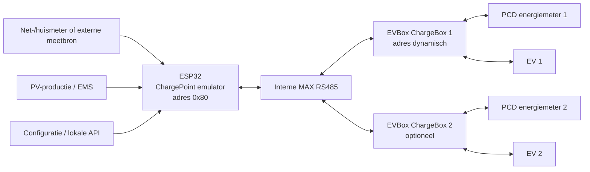

### Architectuurregel

De PCD-meter wordt **uitsluitend via de ChargeBox gebruikt**. De bestaande CB ↔ PCD-communicatie blijft ongemoeid.

De ESP32 gebruikt alleen de meetinformatie die de ChargeBox via MAX rapporteert.

---

# 4. Bronstatus en betrouwbaarheid

De interne MAX-protocolgegevens in dit FO zijn voornamelijk gebaseerd op:

- EVBox MAX reverse-engineering en praktijkcaptures van G2/G3/G4:  
  https://www.geekabit.nl/projects/managed-ev-charger-to-stand-alone/protocol/
- praktijkimplementatie van een standalone ChargePoint-vervanger:  
  https://www.geekabit.nl/projects/managed-ev-charger-to-stand-alone/
- EVBox Autostart Module, een werkende modemvervanger:  
  https://www.geekabit.nl/projects/evbox-charger-autostart-module/
- reverse-engineering van EVBox ChargeStation Tool:  
  https://www.geekabit.nl/projects/reversing-the-evbox-chargestation-tool/

De interne CP↔CB-commando's zijn geen publiek ondersteunde EVBox third-party API. Zij zijn reverse-engineered en op echte hardware getest. Daarom moet de uiteindelijke implementatie defensief zijn en onbekende berichten kunnen loggen zonder te crashen.

---

# 5. Protocolrol

## 5.1 ESP32

De ESP32 vervangt de oorspronkelijke EVBox ChargePoint-controller.

**Vast protocoladres:**

```text
0x80 = ChargePoint / ESP32
```

## 5.2 ChargeBox

Een ChargeBox start na boot op:

```text
0x00 = niet geregistreerd
```

De ESP32 kent daarna een operationeel adres toe, bijvoorbeeld:

```text
CB 1 -> 0x01
CB 2 -> 0x02
CB 3 -> 0x03
...
```

## 5.3 Broadcast

```text
0xBC = broadcast
```

**BEVESTIGD:** registratie van een CB gebeurt via command `0x11`. De CB start op adres `0x00`, meldt serienummer/firmware/hardwaregeneratie en de CP antwoordt via broadcast met het toegewezen adres.

---

# 6. Fysieke/datalaag

Voor de interne MAX-bus:

```text
RS485
38400 baud
8 databits
geen parity
1 stopbit
half duplex
```

De MAX-frame-encoder/decoder moet als afzonderlijke softwaremodule worden uitgevoerd.

De software moet minimaal detecteren:

- begin/einde frame;
- destination;
- source;
- command;
- payload;
- checksumfouten;
- framingfouten;
- timeout;
- onbekende commando's;
- onverwachte bron-/doeladressen.

> **Implementatienoot voor Codex:** framecodering/checksum moet worden geïmplementeerd op basis van de vastgelegde MAX-protocolspecificatie/captures en moet unit-testbaar zijn. Vermeng protocol parsing niet met laadlogica.

---

# 7. Functionele softwarelagen

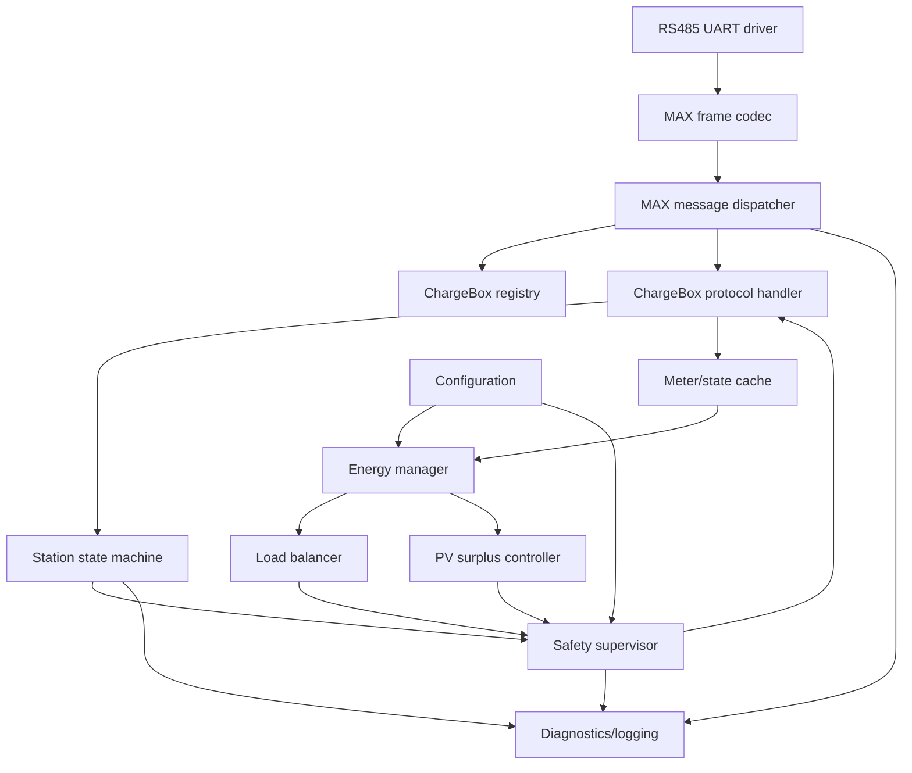

---

# 8. ChargeBox-registratie

## 8.0 Hardwaregeneratie detecteren vóór protocolselectie

**Verplicht onderdeel van de boot/registratiefase**

De ESP32 mag **niet vooraf aannemen** dat een aangesloten ChargeBox G2, G3 of G4 is.

Bij iedere registratie moet de hardwaregeneratie uit het `0x11`-registratiebericht van de ChargeBox worden uitgelezen en opgeslagen.

Te bewaren identificatievelden:

```text
station_registration_number   # handmatig/configuratie, indien bekend
station_serial_number         # typeplaatje, indien bekend
cb_serial_number              # uit MAX CMD 0x11
cb_firmware_version           # uit MAX CMD 0x11
cb_hardware_generation        # uit MAX CMD 0x11
cb_bus_address                # door ESP32 toegewezen
```

Bekende generatiecodering volgens de beschikbare MAX-protocolanalyse:

```text
2 = G2
3 = G3
4 = G4
```

### Requirement GEN-01

De hardwaregeneratie uit `CMD 0x11` geldt voor de software als primaire protocolidentificatie van de ChargeBox.

Voor Reference Station 1 is dit inmiddels daadwerkelijk bevestigd als `hardware_generation = 3`, firmware `140`. Modelnummer, productiedatum, typeplaatje of externe serienummers mogen als aanvullende identificatie worden opgeslagen, maar mogen **niet** gebruikt worden om de MAX-generatie te raden wanneer `CMD 0x11` beschikbaar is.

### Requirement GEN-02

Na ontvangst van `CMD 0x11` moet de ESP32 een protocolprofiel selecteren:

```text
G2 -> MAX_PROFILE_G2
G3 -> MAX_PROFILE_G3
G4 -> MAX_PROFILE_G4
anders -> MAX_PROFILE_UNKNOWN
```

### Requirement GEN-03

De protocolimplementatie moet generatieafhankelijk gedrag ondersteunen. De common MAX-laag bevat alleen gedrag dat aantoonbaar gelijk is tussen generaties. Payloadlengtes, veldposities, ACK-formaten, statusvelden en commandsemantiek die kunnen verschillen worden afgehandeld in het geselecteerde protocolprofiel.

```text
Common MAX layer
        |
        +-- G2 profile
        +-- G3 profile
        +-- G4 profile
        +-- Unknown/safe profile
```

### Requirement GEN-04

Indien de hardwaregeneratie onbekend of nog niet ondersteund is:

- ChargeBox alleen registreren voor zover dit veilig en bekend is;
- raw frames blijven loggen;
- geen onbewezen laadcommando's sturen;
- state `PROTOCOL_UNSUPPORTED` of equivalent gebruiken;
- handmatige commissioning toestaan;
- automatische load balancing en PV-regeling blokkeren.

### Requirement GEN-05

De gedetecteerde generatie moet zichtbaar zijn in diagnose-uitvoer:

```text
CB address:        0x01
CB serial:         <uit CMD 0x11>
Firmware:          <uit CMD 0x11>
Hardware gen:      3
Protocol profile:  MAX_PROFILE_G3
```

### Requirement GEN-06

De combinatie `station_serial_number`, `cb_serial_number`, `cb_hardware_generation` en `cb_firmware_version` moet persistent kunnen worden opgeslagen zodat later firmware- of hardwareverschillen tussen laadpalen traceerbaar zijn.

### TE TESTEN — generatieafhankelijke MAX-verschillen

Voor G2, G3 en G4 moet per werkelijk aangesloten ChargeBox worden vastgesteld welke MAX-commando's en payloadformaten afwijken. Minimaal te vergelijken:

- registratie `0x11`;
- heartbeat `0x21`;
- status `0x6A`;
- uitgebreide status `0x26`;
- meter push `0x66`;
- current limit/start `0x6B`;
- metering start `0x23`;
- metering end `0x24`;
- remote stop `0x32`;
- configuratie-/meterintervalcommando's zoals `0x65`.

De implementatie moet zo worden opgezet dat later per generatie afwijkende encode/decode-functies kunnen worden toegevoegd zonder de common MAX-laag te wijzigen.

### Generatie-selectie state-machine

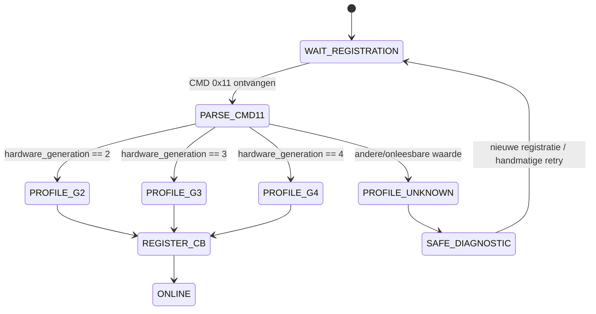

## 8.1 Command `0x11` — CB register

**BEVESTIGD**

Na boot:

```text
CB 0x00 -> CP 0x80
CMD 0x11
payload:
- CB serial number
- firmware version
- hardware generation
```

De CP antwoordt:

```text
CP 0x80 -> broadcast 0xBC
CMD 0x11
payload:
- CB serial number
- toegewezen busadres
- CP hardware generation
```

Voor G3 moet de ESP32 zich functioneel gedragen als een passende CP-generatie. De reverse-engineering toont CP generation 2 of 3.

### TE TESTEN — CP hardware generation

Voor deze implementatie moet tijdens commissioning worden bevestigd welke waarde de doel-G3 ChargeBox verwacht/accepteert.

Voorkeurswaarde voor eerste test:

```text
CP generation = 0x03
```

maar dit is pas definitief na test op de doelhardware.

## 8.2 Adrestoekenning

Adresallocatie moet deterministisch zijn.

Voorkeur:

```text
persistente mapping:
CB serienummer -> busadres
```

Bij eerste detectie:

1. zoek serienummer in persistente configuratie;
2. als bekend: hergebruik eerder adres;
3. als onbekend: wijs laagste vrije adres toe;
4. sla mapping persistent op;
5. antwoord op command `11`.

Geen twee actieve CB's mogen hetzelfde adres krijgen.

---

# 9. Registratiestate-machine

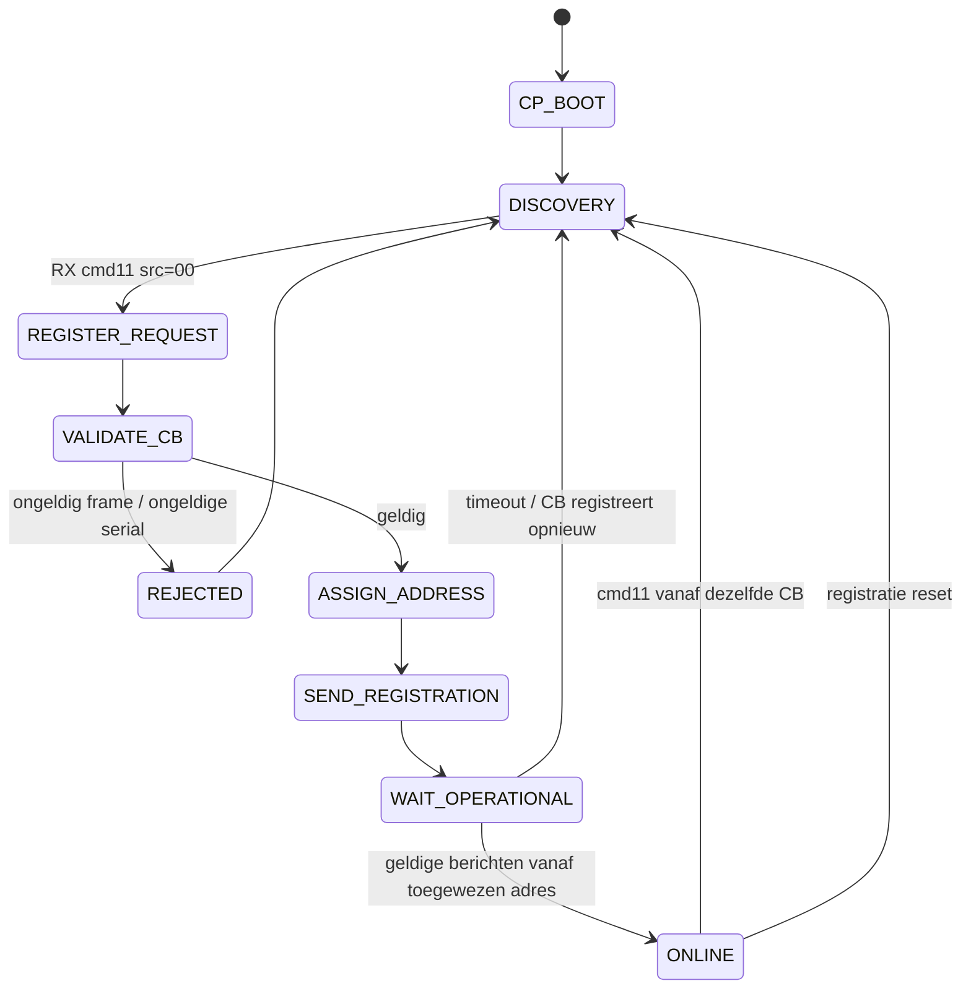

---

# 10. Heartbeat

## 10.1 Command `0x21`

**BEVESTIGD**

```text
CB -> CP
CMD 21
geen payload

CP -> CB
CMD 21
geen payload
```

Waargenomen interval:

```text
ongeveer 16 minuten
```

**BEVESTIGD:** drie gemiste heartbeats kunnen tot reboot van de CB leiden.

Daarom heeft heartbeatverkeer de hoogste protocolprioriteit.

### Requirement HB-01

Een ontvangen geldige heartbeat moet zo snel mogelijk worden beantwoord en mag niet wachten op de load-balancer.

### Requirement HB-02

De CP mag nooit bewust een heartbeat onderdrukken om laden te stoppen.

### Requirement HB-03

Per CB wordt opgeslagen:

```text
last_rx
last_heartbeat_rx
last_heartbeat_tx
communication_health
```

---

# 11. ChargeBox status

## 11.1 Command `0x6A` — charging state

**BEVESTIGD voor G3**

Request:

```text
CB -> CP
CMD 6A
G3 payload: 4 bytes
```

Bekende statecodes:

| Code | Betekenis | Status bron |
|---|---|---|
| `A0` | available | bevestigd |
| `A7` | ready | bevestigd |
| `81` | charging | bevestigd |
| `C1` | finished | bevestigd |
| `80` | unplugged | bevestigd |
| `E7` | failed | bevestigd |
| `07` | onbekend | waargenomen |
| `20` | onbekend | waargenomen |
| `28` | onbekend | waargenomen |
| `2F` | onbekend | waargenomen |

Bekende normale volgorde:

```text
A0 -> A7 -> 81 -> C1 -> 80 -> A0
```

Response:

```text
CP -> CB
CMD 6A
ACK = AA00
```

### Requirement STATE-01

Elke bekende en onbekende `6A` moet worden ge-ACK't indien het frame geldig is, tenzij latere praktijktest een uitzondering aantoont.

### Requirement STATE-02

Een onbekende statecode mag de controller niet laten crashen.

Gedrag:

```text
- log raw state;
- behoud communicatie;
- markeer CB toestand UNKNOWN;
- leg geen nieuwe laadstart op totdat toestand veilig geïnterpreteerd kan worden.
```

---

# 12. Gedetailleerde CB state update — command `0x26`

**BEVESTIGD**

Voor G3 is een uitgebreider statusbericht waargenomen van 132 bytes.

Bekende velden omvatten onder andere:

- state;
- `is charging`;
- LED status;
- lock-status;
- kabelmaximumstroom;
- meterwaarde;
- chassis-temperatuur;
- session-id;
- spanningen;
- fasestromen;
- power factor;
- huidige current limit;
- netfrequentie.

Dit bericht is voor de nieuwe controller een primaire telemetrybron.

De ESP32 moet daarop een response kunnen geven met minimaal de velden die de CB verwacht. Uit captures is een response met session-id en timestamp bekend.

### TE TESTEN — minimale `0x26` response

Nog vaststellen:

- welke responsevelden op de doel-G3 werkelijk verplicht zijn;
- of `session-id = 0` tijdens volledig lokale werking altijd wordt geaccepteerd;
- welke timestampvelden exact noodzakelijk zijn;
- of een lege/minimale ACK toegestaan is.

Totdat dit gemeten is moet Codex een expliciet configureerbare protocoladapter maken en raw capture logging ondersteunen.

---


# 12A. G3 firmware 140 compatibility profile

Voor de huidige referentiepaal moet een expliciet profiel beschikbaar zijn:

```text
profile_id = MAX_PROFILE_G3_FW140
generation = 3
firmware   = 140
```

Minimaal bekende eigenschappen:

```text
register_cmd              = 0x11
state_cmd                 = 0x6A
state_ack                 = AA00
extended_state_cmd        = 0x26
extended_state_len        = 132
config_read_cmd           = 0x33
meter_interval_cmd        = 0x65
meter_push_cmd            = 0x66
periodic_cmd18            = 0x18   # functie nog TE TESTEN
```

Codex moet profielselectie in twee stappen ondersteunen:

```text
hardware generation
       |
       v
basisprofiel G2/G3/G4
       |
       v
optionele firmware overlay
bijv. G3_FW140
```

---

# 13. PCD-meterdata via ChargeBox

## 13.1 Architectuur

De PCD-meter blijft verbonden met de ChargeBox.

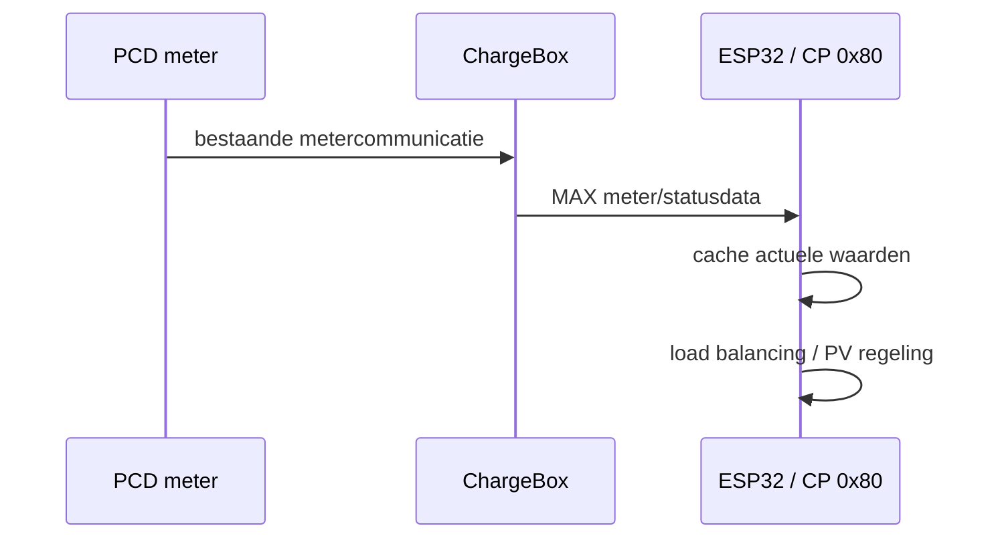

## 13.2 Command `0x66` — Push meter value

**BEVESTIGD**

Een G3/CB kan meterwaarden naar de CP pushen.

Waargenomen payload bevat:

- voltage L1/L2/L3;
- current L1/L2/L3;
- power factor L1/L2/L3;
- cumulatieve meterwaarde.

## 13.3 Command/configuratie `0x65` — meter update interval

**BEVESTIGD in reverse-engineered protocol**

Een meter-update-interval bestaat.

Voorbeeld:

```text
60 s -> 0x003C
0 -> periodieke update uit
```

### Bevestigd voor G3 firmware 140 — richting/semantiek command `65`

Op Reference Station 1 is werkelijk gestuurd:

```text
CP 0x80 -> CB 0x01
CMD 0x65
data=000F
```

Daarna zijn `CMD 0x66` meterpushes met circa 15 s interval ontvangen.

Voor **G3 firmware 140** geldt daarom:

```text
CMD 0x65 = configure meter push interval
payload  = uint16 interval in seconden
0x000F   = 15 s
```

### TE TESTEN — overige `0x65` eigenschappen

De protocolpagina bevat bij dit commando inconsistente tekstlabels over requestrichting. De capture toont CP/CB-verkeer waarmee een 60 s interval resulteert in command `66` pushes.

Voor het doelproject moet vóór definitieve implementatie worden vastgelegd:

1. welk exact frame op de G3 moet worden gestuurd om het update-interval te wijzigen;
2. welk minimuminterval de CB/PCD betrouwbaar verdraagt;
3. of het reeds werkende huidige gedrag beter ongemoeid kan blijven.

**Eerste implementatie-eis:** verander het bestaande meterinterval niet automatisch. Eerst alleen ontvangen en loggen.

---

# 14. Meter-/telemetrymodel

Per ChargeBox moet minimaal worden bijgehouden:

```text
serial_number
bus_address
hardware_generation
firmware_version

protocol_state
charging_state_raw
charging_state_normalized
is_charging
cable_current_max_A

voltage_L1_V
voltage_L2_V
voltage_L3_V

current_L1_A
current_L2_A
current_L3_A

power_factor_L1
power_factor_L2
power_factor_L3

energy_total_kWh
temperature_C
frequency_Hz

reported_current_limit_A
session_id

last_seen_ms
last_meter_update_ms
last_state_update_ms
last_command_6a_ms
```

Alle ruwe waarden moeten beschikbaar blijven voor diagnose.

---

# 15. Starten en stroominstelling

## 15.1 Command `0x6B` — set current limit

**BEVESTIGD**

De CP stuurt naar een CB:

```text
CMD 6B
payload lengte 18 bytes
```

Bekende velden:

```text
2 bytes  vaste/onbekende waarde
4 bytes  minimum current * 10
4 bytes  current limit L1 * 10
4 bytes  current limit L2 * 10
4 bytes  current limit L3 * 10
```

Waargenomen voorbeeld:

```text
minimum = 6.0 A
limits  = 16.0 / 16.0 / 16.0 A
```

**BEVESTIGD:** command `6B` functioneert tevens als start charging in de onderzochte implementatie.

De CB geeft een lege response op `6B`.

## 15.2 Minimumstroom

Waargenomen werkende minimumwaarde:

```text
6.0 A = 0x003C
```

### TE TESTEN

Niet aannemen dat 6.0 A in iedere situatie altijd de juiste functionele minimumwaarde is.

Tijdens commissioning moet worden bevestigd:

- gedrag bij 6 A;
- gedrag bij waarden < 6 A;
- gedrag bij 0 A;
- gedrag bij `0xFFFF`;
- relatie tussen minimumveld en drie limietvelden.

Voor productie moet de minimumstroom configureerbaar blijven.

---

# 16. Startsequence

De gewenste basisflow voor een aangesloten voertuig:

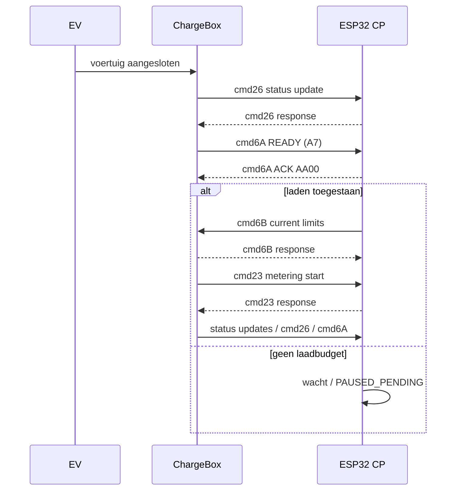

### TE TESTEN — starten zonder RFID/autostartconfiguratie

RFID is fysiek verwijderd.

Nog moet op de specifieke ChargeBox worden bevestigd welke configuratie nodig is om na aansluiten vanzelf de toestand te bereiken waarin `6B` een sessie kan starten.

Mogelijke factoren uit reverse engineering:

- CB-configuratieveld `enable auto start`;
- command `31` remote start;
- `6B` direct na READY.

De eerste commissioningtests moeten bepalen welke minimale route het meest betrouwbaar is.

**Codex mag geen RFID-request simuleren tenzij later expliciet besloten.**

---

# 17. Command `0x23` — metering start

**BEVESTIGD**

Na laadstart stuurt de CB een metering-start request.

Bekende requestgegevens:

- kaartnummerlengte;
- kaartnummer/stringveld;
- meterwaarde.

G3 response:

- status;
- session-id;
- timestamp.

Waargenomen gedrag:

- eerste response kan session-id `0` bevatten;
- een tweede response met echte session-id is waargenomen;
- het weglaten van die tweede response werd in tests door de CB geaccepteerd.

## Ontwerpkeuze

De nieuwe controller genereert zelf een lokale 32-bit session-id.

### TE TESTEN

Voor eerste bring-up moet worden getest:

A. minimale response met session-id 0;  
B. één definitieve response met eigen session-id;  
C. eventueel origineel twee-responsegedrag.

De eenvoudigste variant die betrouwbaar werkt wordt productiegedrag.

---

# 18. Command `0x24` — metering end

**BEVESTIGD**

Bij einde van een sessie kan de CB command `24` sturen.

Bekende data:

- kaart/stringveld;
- eindmeterstand;
- session-id;
- state;
- timestamp.

Response bevat een statusbyte/-veld.

De implementatie moet:

1. frame ACK'en;
2. eindmeterstand opslaan;
3. lokale sessie afsluiten;
4. status pas IDLE verklaren nadat CB-status dit bevestigt.

---

# 19. Stoppen, pauzeren en hervatten

Dit is het belangrijkste open protocolpunt voor PV-surplus.

## 19.1 Hard bevestigd

Er bestaan:

```text
CMD 32 = remote stop
CMD 6B = current limit en start charging
```

Command `32` bevat een session-id en levert succes/fail-response.

## 19.2 Niet bewezen

Nog **niet** hard vastgesteld voor de doel-G3:

- of `6B` met 0 A een nette tijdelijke laadpauze geeft;
- of deze pauze dezelfde sessie behoudt;
- of contactor opent;
- welke `6A` toestand daarna volgt;
- of vervolgens een nieuwe `6B` de bestaande sessie probleemloos hervat;
- of `CMD 32` nodig is;
- of `CMD 32` de sessie definitief beëindigt;
- welke aanpak het beste is voor herhaald PV-pauzeren.

## 19.3 Vereiste commissioningtest

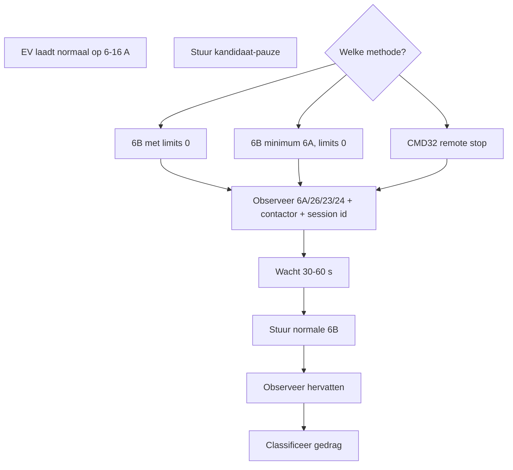

Testresultaat moet worden opgenomen in een later protocolprofiel, bijvoorbeeld:

```text
pause_method = LIMIT_ZERO
resume_method = SET_CURRENT
session_preserved = true
```

of:

```text
pause_method = REMOTE_STOP
resume_method = NEW_SESSION
session_preserved = false
```

Zonder deze test mag PV-surplus geen automatisch herhaald pauze/hervatgedrag activeren.

---

# 20. Genormaliseerde laadstates in de ESP32

De applicatie gebruikt niet direct overal ruwe EVBox-states.

Gebruik:

```text
OFFLINE
REGISTERING
PROTOCOL_UNSUPPORTED
IDLE
EV_CONNECTED
READY
STARTING
CHARGING
PAUSE_PENDING
PAUSED
RESUME_PENDING
STOPPING
FINISHED
FAILED
UNKNOWN
```

## Mapping

| EVBox/raw situatie | Interne state |
|---|---|
| geen communicatie | OFFLINE |
| adresprocedure actief | REGISTERING |
| `6A=A0` | IDLE |
| cmd26 kabel aangesloten, niet charging | EV_CONNECTED |
| `6A=A7` | READY |
| `6B` verzonden, nog niet charging | STARTING |
| `6A=81` of betrouwbaar `is_charging=1` | CHARGING |
| pauzecommand verzonden | PAUSE_PENDING |
| bevestigd pauzegedrag | PAUSED |
| hervatcommand verzonden | RESUME_PENDING |
| stopcommand verzonden | STOPPING |
| `6A=C1` | FINISHED |
| `6A=E7` | FAILED |
| onbekende state | UNKNOWN |

---

# 21. Hoofdstate-machine laadpunt

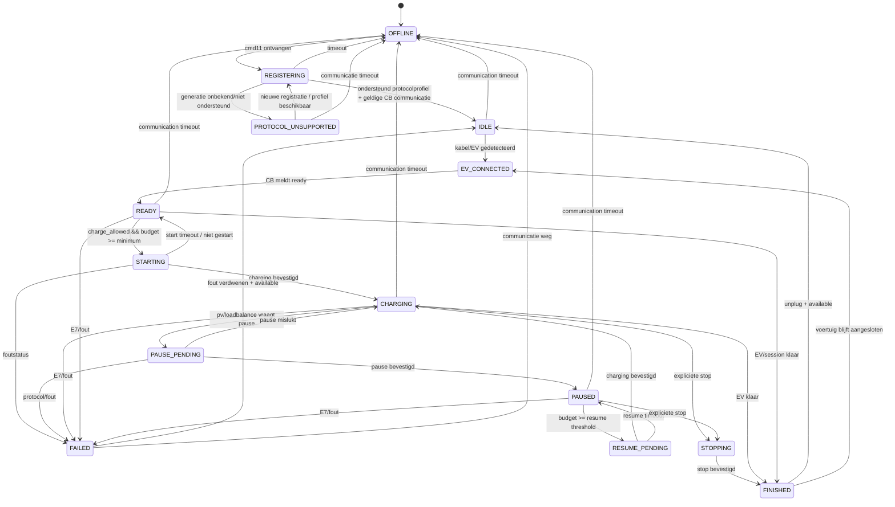

---

# 22. Protocoldispatcher

Voor elk ontvangen frame:

```text
1. valideer frame
2. identificeer source CB
3. update last_seen
4. dispatch op command
5. stuur protocolantwoord indien vereist
6. update telemetry/state
7. genereer event naar energy manager
8. log afwijkingen
```

Minimaal te ondersteunen RX-commando's:

| Command | Functie | Prioriteit |
|---|---|---|
| `11` | registratie | kritisch |
| `21` | heartbeat | kritisch |
| `23` | metering start | hoog |
| `24` | metering end | hoog |
| `26` | state/telemetry | hoog |
| `66` | meter push | hoog |
| `6A` | charging state | kritisch |
| `6B response` | current command ACK | hoog |
| overige | loggen, niet crashen | normaal |

Minimaal te ondersteunen TX-commando's:

| Command | Functie |
|---|---|
| `11` | registratieantwoord |
| `21` | heartbeatantwoord |
| `23 response` | metering start |
| `24 response` | metering end |
| `26 response` | state update response |
| `6A response` | ACK |
| `6B` | stroom/start |
| `32` | alleen na validatie stopgedrag |
| `65` | alleen na validatie meterinterval |
| `1E` | optioneel, registratie herstarten |

---

# 23. Multi-ChargeBox ondersteuning

Het systeem moet vanaf ontwerp meerdere CB's ondersteunen, ook wanneer aanvankelijk één laadpunt wordt gebruikt.

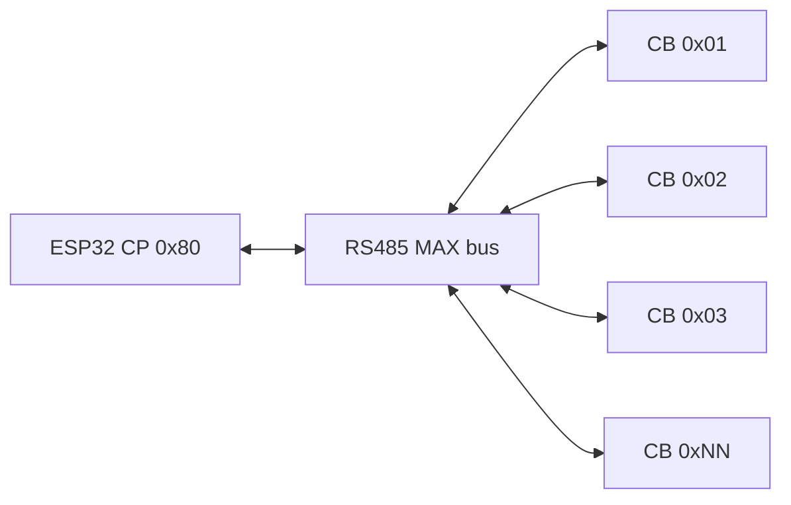

Per CB bestaat een afzonderlijke:

- registratie;
- state-machine;
- session context;
- meter cache;
- current setpoint;
- timeoutbewaking;
- faseconfiguratie;
- prioriteit.

---

# 24. Configuratiemodel

Persistente configuratie minimaal:

```yaml
system:
  cp_address: 0x80
  cp_generation: 3              # TE TESTEN / configureerbaar
  mode: LOAD_BALANCE            # OFF / MANUAL / LOAD_BALANCE / PV_SURPLUS / HYBRID
  commissioning_mode: false

site:
  max_current_l1_a: 25.0
  max_current_l2_a: 25.0
  max_current_l3_a: 25.0
  safety_margin_l1_a: 0.0       # door gebruiker te configureren
  safety_margin_l2_a: 0.0
  safety_margin_l3_a: 0.0

pv:
  enabled: false
  target_grid_power_w: 0
  start_delay_s: 60
  stop_delay_s: 60
  minimum_surplus_w: 0          # bepalen bij commissioning
  hysteresis_w: 0               # engineeringparameter

chargeboxes:
  - serial: "1917911"
    bus_address: 1
    enabled: true
    max_current_a: 16.0
    minimum_current_a: 6.0      # voorlopig; commissioning
    priority: 100
    phase_map:
      cb_l1: grid_l1
      cb_l2: grid_l2
      cb_l3: grid_l3
```

Geen voorbeeldwaarde uit dit FO mag door Codex als universele veilige installatiegrens worden vast ingebakken.

---

# 25. Fase-mapping

Voor iedere CB moet expliciet zijn vastgelegd welke CB-fase met welke fysieke netfase overeenkomt.

Voorbeeld:

```text
CB1:
L1 -> Grid L1
L2 -> Grid L2
L3 -> Grid L3

CB2:
L1 -> Grid L2
L2 -> Grid L3
L3 -> Grid L1
```

De energy manager rekent altijd in **gridfasecoördinaten**.

De protocoladapter vertaalt daarna naar CB L1/L2/L3.

---

# 26. Load balancing

## 26.1 Doel

Voorkomen dat ingestelde sitegrenzen per fase worden overschreden.

De externe net-/huismeting is de primaire bron voor de totale netbelasting.

CB/PCD-waarden zijn primaire bron voor het individuele laadgedrag van de EVBox.

## 26.2 Concept

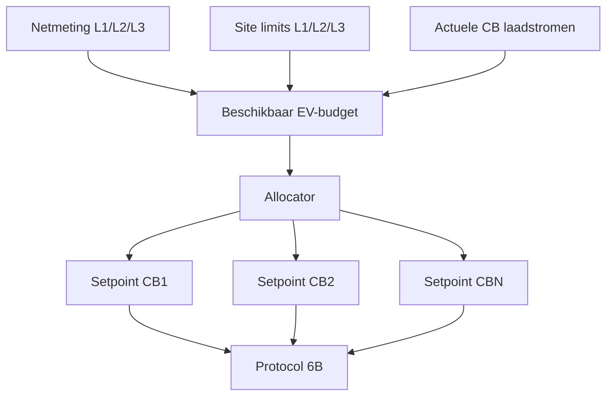

## 26.3 Basisregel

Per fysieke fase:

```text
remaining_phase_current =
configured_site_limit
- measured_site_current
+ currently_measured_EV_current_that_can_be_reallocated
- safety_margin
```

De precieze formule hangt af van de plaats en tekenconventie van de externe netmeter.

### Requirement LB-01

De meettopologie en tekenconventie moeten configureerbaar en tijdens commissioning gevalideerd zijn.

### Requirement LB-02

De allocator mag nooit een setpoint boven:

- stationmaximum;
- kabelmaximum voor zover bekend;
- sitebudget;
- gebruikersmaximum

geven.

### Requirement LB-03

Onzekere meetdata moet leiden tot een conservatieve setpointverlaging of blokkering van nieuwe laadstarts.

---

# 27. Allocator voor meerdere EV's

Eerste implementatie: eenvoudige priority/fair-share allocator.

Functionele volgorde:

1. bepaal welke CB's laadbaar zijn;
2. reserveer per actieve EV minimaal de geconfigureerde minimumstroom indien budget dat toelaat;
3. indien budget onvoldoende is voor alle EV's:
   - gebruik prioriteit;
   - of pauzeer één of meer EV's;
4. verdeel resterend budget;
5. clamp per fase;
6. vertaal naar CB-setpoints;
7. stuur alleen bij betekenisvolle verandering.

Later kan weighted fair sharing worden toegevoegd.

---

# 28. PV-surplusmodus

## 28.1 Doel

Zoveel mogelijk lokaal PV-overschot in de EV laden zonder ongewenste netimport, binnen de ingestelde toleranties.

## 28.2 Bronnen

PV-surplus mag worden berekend uit:

- netimport/export aan aansluitpunt; of
- expliciete PV-productie + lokale belasting.

Voorkeur is closed-loop regeling op het aansluitpunt indien die betrouwbare meetwaarde beschikbaar is.

## 28.3 State-machine PV regeling

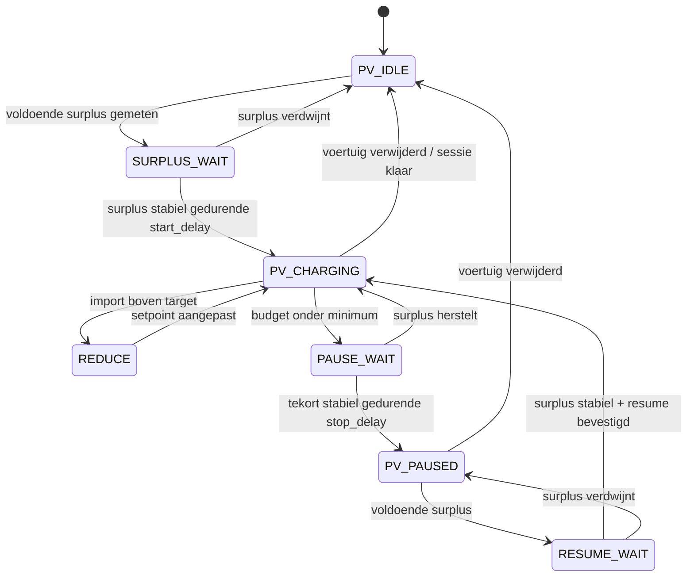

## 28.4 TE TESTEN

PV pause/resume wordt pas vrijgegeven nadat het gedrag uit hoofdstuk 19 gevalideerd is.

Tot die tijd heeft PV-modus de beperking:

```text
PV-surplus kan alleen moduleren binnen een reeds actieve laadband >= minimumstroom.
```

---

# 29. Setpointmanagement

Per CB:

```text
requested_current_l1
requested_current_l2
requested_current_l3

last_sent_current_l1
last_sent_current_l2
last_sent_current_l3

effective_reported_limit
```

Een nieuw `6B` commando wordt alleen gestuurd wanneer:

- state het toelaat;
- communicatie gezond is;
- setpoint geldig is;
- verandering groter is dan configureerbare deadband; of
- refresh/watchdogbeleid dit vereist.

### TE TESTEN — refreshinterval `6B`

Nog bepalen of de CB periodiek opnieuw een `6B` nodig heeft of dat alleen wijzigingen voldoende zijn.

Niet onnodig snel blijven zenden voordat dit bekend is.

---

# 30. Veiligheidslogica

De ESP32 vervangt geen elektrische veiligheidsfuncties van de ChargeBox.

De ChargeBox blijft verantwoordelijk voor:

- CP-signaal;
- EV-laadtoestand;
- contactor;
- lokale beveiligingslogica;
- interne meterinterface.

De ESP32 moet zich conservatief gedragen.

## 30.1 Bij verlies externe netmeting

Configureerbaar beleid:

```text
SAFE_STOP
of
SAFE_CURRENT
```

Voorkeur voor eerste commissioning:

```text
geen nieuwe laadstart
bestaande lader naar conservatief configureerbaar setpoint
```

Exact gedrag wordt door gebruiker/installatie bepaald.

## 30.2 Bij verlies CB-communicatie

- markeer CB OFFLINE;
- stuur niet blind door;
- verwijder CB niet meteen uit persistente mapping;
- genereer alarm;
- voorkom nieuwe sessiestart;
- ga ervan uit dat het laatst door CB geaccepteerde gedrag onbekend kan blijven totdat CB opnieuw rapporteert.

## 30.3 Bij ESP32 reboot

Na reboot:

1. ga niet uit van oude runtime-state;
2. start communicatie/listen;
3. herstel registratie;
4. lees actuele CB-status;
5. start pas loadbalancing na voldoende verse telemetry.

---

# 31. Watchdogs

Minimaal:

```text
UART receive watchdog
MAX parser watchdog
per-CB last_seen watchdog
meter freshness watchdog
external grid meter freshness watchdog
energy-manager watchdog
ESP32 task watchdog
```

Geen watchdog mag automatisch een onbewezen protocolcommando sturen.

---

# 32. Foutclassificatie

```text
INFO
WARNING
DEGRADED
FAULT
CRITICAL
```

Voorbeelden:

| Fout | Klasse |
|---|---|
| onbekend MAX command | INFO/WARNING |
| checksum error | WARNING |
| enkele gemiste CB-message | WARNING |
| CB timeout | FAULT |
| externe netmeter stale | FAULT |
| CB `6A=E7` | FAULT |
| onmogelijke stroommeting | FAULT |
| address conflict | CRITICAL |
| parserbuffer overflow | CRITICAL |

---

# 33. Diagnose en logging

Logging moet protocolontwikkeling ondersteunen.

Minimaal loggen:

```text
timestamp
RX/TX
source
destination
command
raw payload
parse result
CB serial/address
normalized event
current state
requested setpoint
reason for setpoint
error/status
```

Loggingniveaus:

```text
ERROR
WARN
INFO
DEBUG
TRACE_MAX
```

`TRACE_MAX` moet alle raw MAX-frames kunnen vastleggen voor vergelijking met bekende EVBox-captures.

---

# 34. Commissioningmodus

Een aparte commissioningmodus is verplicht.

In deze modus:

- automatische loadbalancing staat uit;
- automatische PV-regeling staat uit;
- gebruiker kan één protocolactie tegelijk uitvoeren;
- alle RX/TX wordt volledig gelogd;
- stroomcommando's worden begrensd door een commissioningmaximum;
- open protocolvragen kunnen systematisch worden getest.

Mogelijke commando's:

```text
list_cb
show_cb <address>
send_current <address> <L1> <L2> <L3>
send_stop <address>
show_meter <address>
dump_state <address>
enable_trace
disable_trace
restart_registration
```

---

# 35. Testmatrix open protocolpunten

## T01 — Registratie zonder modem

**Doel:** aantonen dat ESP32 CP de G3 zelfstandig registreert.

Stappen:

1. originele modem verwijderd;
2. ESP32 op werkende CB-RS485;
3. CB power-cycle;
4. wacht command `11`;
5. antwoord CP generation 3 + adres 1;
6. observeer berichten vanaf 1.

**Acceptatie:** CB blijft operationeel en reboot niet door ontbrekende CP.

---

## T02 — Heartbeat

1. CB registreren;
2. wacht heartbeat;
3. ACK;
4. observeer > 1 heartbeatperiode.

**Acceptatie:** geen CB reboot.

Negatieve test alleen gecontroleerd uitvoeren:

- ACK tijdelijk onderdrukken;
- bevestig werkelijk gedrag na drie gemiste heartbeats.

---

## T03 — `6A` state sequence

Doel:

```text
A0 -> A7 -> 81 -> C1 -> 80 -> A0
```

op doelhardware bevestigen en raw extra bytes vastleggen.

---

## T04 — Start zonder RFID

Testvarianten:

A. huidige CB-configuratie + direct `6B`;  
B. auto-start-configuratie indien nodig;  
C. command `31` indien nodig.

**Resultaat:** kies minimale betrouwbare startmethode.

---

## T05 — `6B` minimumveld

Test gecontroleerd:

```text
minimum = 6.0 A
limits = 6/6/6 A
```

Daarna relevante varianten.

**Doel:** bevestigen minimumsemantiek voor doel-G3.

---

## T06 — Dynamisch verhogen/verlagen

Tijdens laden:

```text
6 A -> 10 A -> 16 A -> 8 A -> 6 A
```

Log:

- commando;
- ACK;
- CB-reported limit;
- PCD current;
- vertraging tot nieuwe werkelijke stroom.

---

## T07 — Pauze via nul

Test kandidaten uit hoofdstuk 19.

Vastleggen:

- contactor;
- CP/EV status;
- `6A`;
- `26`;
- `23/24`;
- session-id;
- energie;
- hervatbaarheid.

---

## T08 — Remote stop `32`

Alleen uitvoeren na een normale actieve sessie.

Vastleggen:

- response;
- `6A`;
- `24`;
- session-id;
- mogelijkheid nieuwe sessie te starten.

---

## T09 — Meter push `66`

Vastleggen:

- werkelijke frequentie;
- payload;
- scaling;
- fasevelden;
- vergelijking met PCD-display/bekende waarde.

---

## T10 — Meterinterval `65`

Pas uitvoeren nadat gewone meterpush betrouwbaar gelogd is.

Test voorzichtig met ruime intervallen.

---

## T11 — ESP32 reboot tijdens laden

Doel:

- bepalen gedrag ChargeBox wanneer CP tijdelijk verdwijnt;
- bepalen of laden doorgaat;
- bepalen na hoeveel tijd CB ingrijpt;
- bepalen hoe sessie na CP-herstart hersteld kan worden.

Dit is een kritische failsafetest.

---

## T12 — CB reboot tijdens actieve ESP32

Doel:

- detectie command `11`;
- behoud/nieuwe adresallocatie;
- correcte state recovery;
- geen ongewenste automatische laadstart.

---

# 36. Requirements voor Codex-implementatie

Codex moet het project modulair implementeren.

Voorgestelde componenten:

```text
src/
  max/
    max_frame.*
    max_codec.*
    max_parser.*
    max_commands.*
  evbox/
    cb_registry.*
    cb_protocol.*
    cb_state_machine.*
    cb_telemetry.*
    cb_session.*
  energy/
    site_meter.*
    load_balancer.*
    pv_surplus.*
    allocator.*
  safety/
    safety_supervisor.*
    watchdogs.*
  config/
    config.*
    persistence.*
  diagnostics/
    logger.*
    commissioning_cli.*
  app/
    main_controller.*
```

Geen magic numbers verspreiden over code.

Gebruik enums/constants voor:

- adressen;
- commands;
- states;
- timeouts;
- scalingfactoren.

---

# 37. Unit tests

Minimaal unit-testbaar:

- frame encoding;
- frame checksum;
- frame decoding;
- corrupt frame reject;
- command dispatch;
- command `11` parsing;
- address allocator;
- command `6A` parsing;
- command `6B` builder;
- command `26` parser voor bekende velden;
- command `66` parser;
- session state machine;
- load balancer;
- PV state machine;
- stale-meter behavior;
- multi-CB allocation.

Raw captures moeten later als regression fixtures kunnen worden toegevoegd.

---

# 38. Integration tests

Een hardware-in-the-loop testlaag moet later minimaal kunnen:

```text
mock CB
real CB
record/replay MAX trace
```

Aanbevolen mogelijkheid:

```text
MAX trace file -> parser -> exact dezelfde events als live UART
```

Hiermee kan Codex software ontwikkelen/testen zonder voor iedere wijziging een voertuig aan te sluiten.

---

# 39. Niet-functionele eisen

## Betrouwbaarheid

- geen dynamic allocation in ISR;
- protocol RX mag niet door zware regelberekeningen blokkeren;
- heartbeat en ACK's hebben prioriteit;
- geen heapgebruik in kritieke RX-loop indien vermijdbaar;
- bounded buffers;
- recovery na malformed input.

## Onderhoudbaarheid

- protocolvelden documenteren met bron/status;
- ieder onzeker veld voorzien van `TODO_TEST` of vergelijkbare tag;
- raw protocoldata altijd terugvindbaar;
- hardware/pinconfiguratie los van protocolcode.

## Veiligheid

- geen setpoint boven geconfigureerde hard limit;
- geen laden bij ongeldige configuratie;
- geen automatische start na boot voordat actuele CB-state bekend is;
- bij twijfel conservatief gedrag.

---

# 40. Beslislogica op hoofdniveau

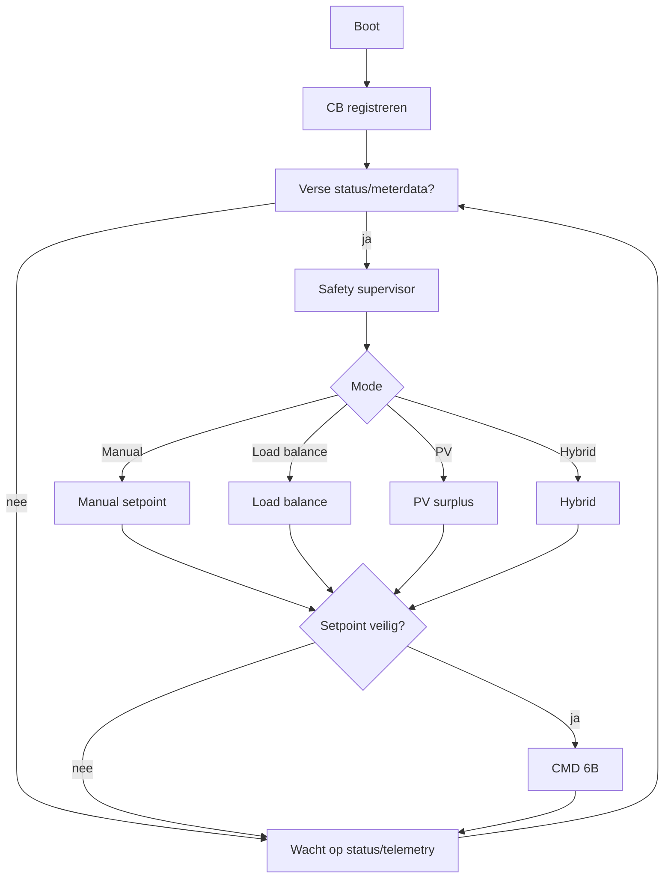

---

# 41. Open punten vóór productie

De volgende punten zijn bewust **NIET als feit vastgelegd** en moeten met de echte G3 worden gevalideerd:

1. exacte CP-generationwaarde in registratie;
2. per werkelijk aangetroffen CB-generatie (G2/G3/G4) vaststellen welke MAX-commando's/payloads afwijken;
2. minimale verplichte `26` response;
3. noodzakelijke CB-configuratie voor start zonder RFID;
4. of direct `6B` vanuit READY voldoende is;
5. exacte betekenis van het `6B` minimum-currentveld;
6. gedrag van `6B` bij 0 A;
7. beste pause/resume-methode;
8. sessiebehoud tijdens pause/resume;
9. gedrag van `CMD32` op de specifieke firmware;
10. gewenste/veilige frequentie van `6B` updates;
11. exacte `65` requestrichting/semantiek op de doel-G3;
12. praktisch minimum meter-update-interval;
13. gedrag bij ESP32/CP-uitval tijdens een actieve laadsessie;
14. gedrag bij onverwachte CB reboot;
15. betekenis van onbekende G3 statecodes `07`, `20`, `28`, `2F`;
16. eventuele firmware-afhankelijke afwijkingen in payloadlengtes;
17. fasegedrag bij ongelijke `6B` L1/L2/L3-limieten;
18. precieze transitionele timing tussen READY, 6B, metering start en CHARGING.

Geen van deze punten mag in productiecode worden verborgen achter een niet-gedocumenteerde aanname.

---
20. exacte functie/noodzaak van periodiek `CMD 0x18 data=02`.

# 42. Definition of Done — fase 1 protocolcontroller

Fase 1 is gereed wanneer:

- ESP32 zonder modem een CB registreert;
- hardwaregeneratie uit `CMD 0x11` correct wordt uitgelezen en een G2/G3/G4/UNKNOWN protocolprofiel selecteert;
- heartbeat betrouwbaar werkt;
- states `6A` en telemetry `26` worden gelezen;
- PCD-meterinformatie via CB wordt gelezen;
- laadstart zonder RFID reproduceerbaar werkt;
- stroom met `6B` aantoonbaar van 6 A naar meerdere hogere/lage setpoints kan worden gewijzigd;
- sessiestart/-einde correct wordt afgehandeld;
- een ESP32 reboot niet tot een ongecontroleerde softwaretoestand leidt;
- alle onbekende frames kunnen worden gelogd.

---

# 43. Definition of Done — fase 2 load balancing

Fase 2 is gereed wanneer:

- externe sitebelasting per fase betrouwbaar beschikbaar is;
- meerdere CB's afzonderlijk worden geadresseerd;
- allocator de sitegrenzen respecteert;
- stale metingen een veilige reactie geven;
- stroomverlaging en -verhoging op echte voertuigen zijn gevalideerd;
- logging achteraf verklaart waarom ieder setpoint gekozen werd.

---

# 44. Definition of Done — fase 3 PV-surplus

Fase 3 is pas gereed nadat pause/resume op de doel-G3 bewezen is.

Vervolgens:

- PV-surplussetpoint werkt closed-loop;
- hysterese voorkomt snel pendelen;
- minimumlaadstroom wordt gerespecteerd;
- pauzeren en hervatten is reproduceerbaar;
- sessiegedrag is bekend;
- PV-regeling kan nooit site-load-balancing overrulen;
- load-balancing/safety heeft altijd hoogste prioriteit.

Prioriteitsvolgorde:

```text
1. elektrische/installatiegrenzen
2. communicatie- en safetyregels
3. site load balancing
4. voertuig/CB-limieten
5. PV-surplusdoel
6. comfort/fairness/prioriteit
```

---

# 45. Samenvatting voor implementerende AI/Codex

Implementeer een ESP32-controller die op de interne EVBox MAX-RS485-bus de oorspronkelijke ChargePoint op adres `0x80` vervangt.

Belangrijk:

- gebruik de ChargeBox als eigenaar van CP/contactor/PCD-meter;
- communiceer nooit direct met de PCD-meter;
- implementeer geen RFID;
- registreer ChargeBoxes met command `11`;
- antwoord heartbeat `21`;
- ACK charging-state `6A`;
- lees `26` en `66` voor state/metertelemetry;
- gebruik `6B` voor laadstroom en laadstart;
- behandel `23` en `24` voor sessiemetering;
- implementeer `32` nog niet als standaard stop totdat getest;
- implementeer `65` nog niet actief totdat richting/gedrag getest;
- bouw multi-CB vanaf het begin in;
- scheid protocol, state-machine, energy management en safety;
- behandel ieder in hoofdstuk 41 genoemd punt als expliciet commissioning-/testpunt;
- verzin geen ontbrekend protocolgedrag.

De eerste softwareversie moet primair een robuuste **CP-emulator + protocolrecorder + handmatige commissioningcontroller** zijn. Pas nadat de open protocolpunten op echte hardware zijn ingevuld worden automatische load balancing en PV-pauze/hervatten vrijgegeven.
