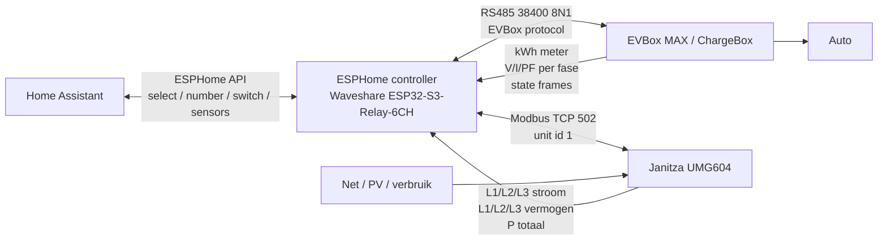
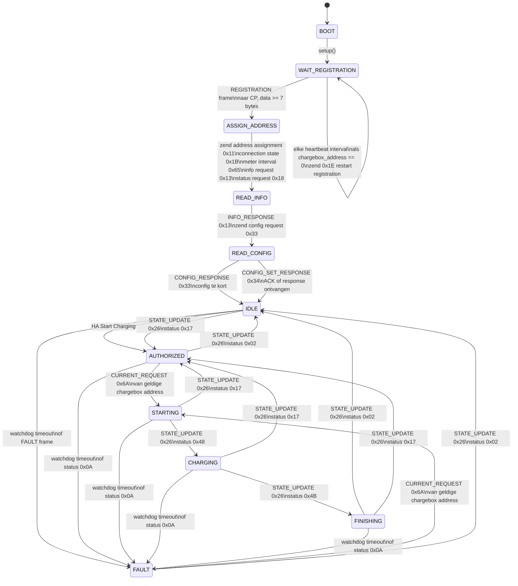
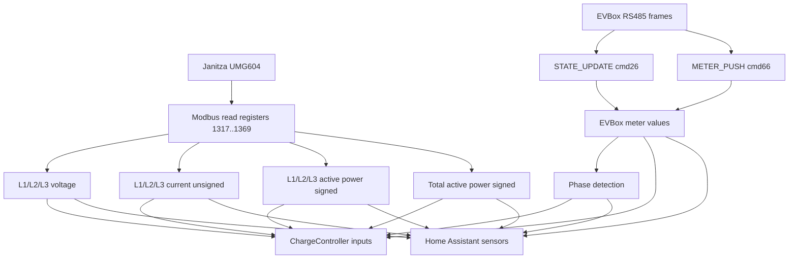
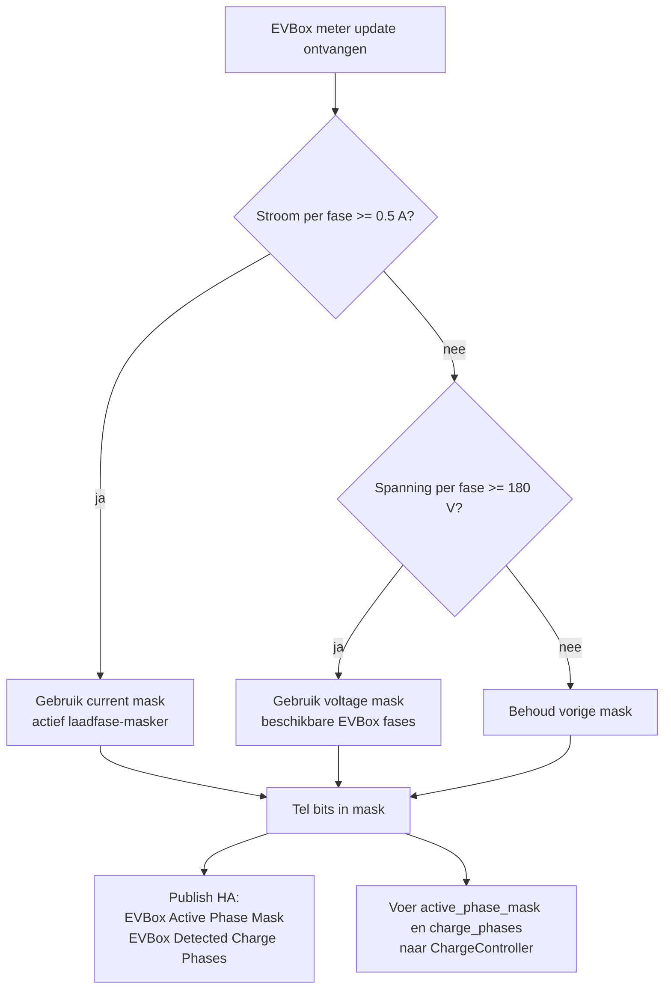
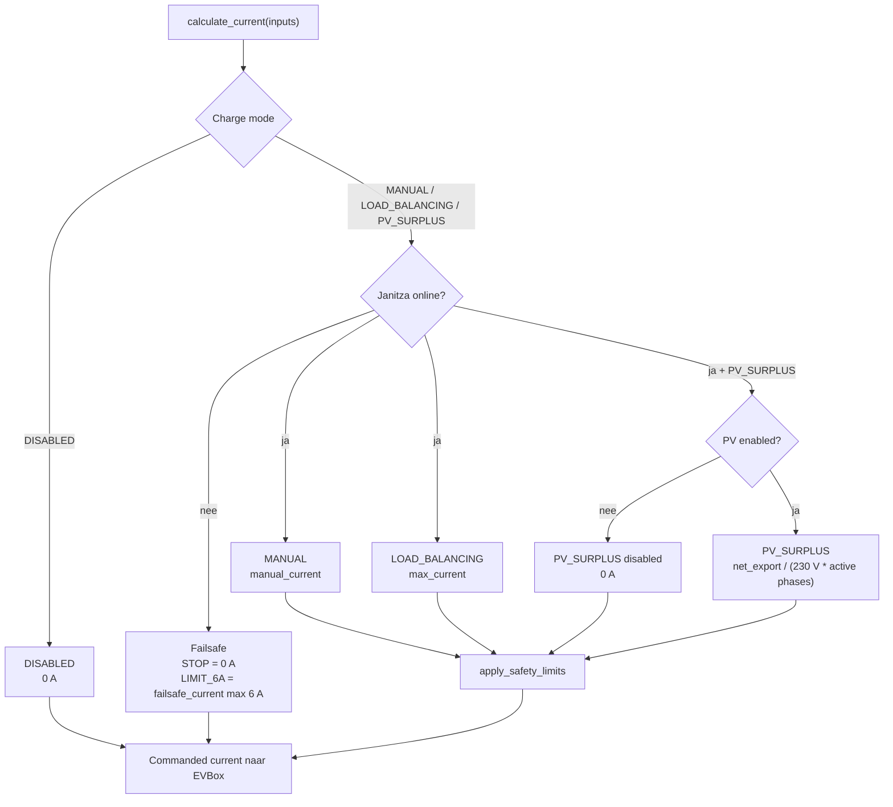
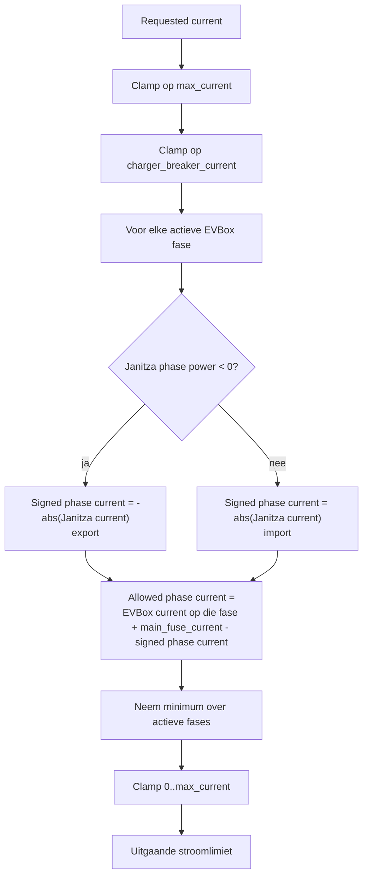
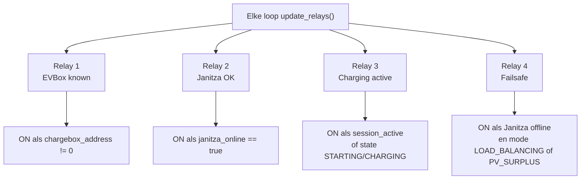

# Functioneel ontwerp EVLoadBalance WaveShare

## Doel

Dit ontwerp beschrijft de ESPHome firmware voor de Waveshare ESP32-S3-Relay-6CH als lokale controller tussen:

- EVBox MAX / ChargeBox via RS485
- Janitza UMG604 via Modbus TCP
- Home Assistant via ESPHome API

De controller leest netbelasting, EVBox meterwaarden en HA-instellingen, bepaalt daaruit de toegestane laadstroom en stuurt deze terug naar de EVBox. Instellingen uit Home Assistant worden in NVS opgeslagen zodat ze een powercycle overleven.

## Systeemcontext



## Hoofdcomponenten

| Component | Verantwoordelijkheid |
| --- | --- |
| `evbox_max` | EVBox protocol, state-machine, meterdata, laadstroomcommando, HA entities, NVS settings, relais |
| `janitza_umg604` | Modbus TCP uitlezing Janitza registers en doorgeven van netdata aan `evbox_max` |
| `ChargeController` | Berekening gewenste laadstroom voor Manual, Load Balancing, PV Surplus en Failsafe |

## EVBox state-machine



## EVBox transitievoorwaarden

| Van | Naar | Voorwaarde | Actie |
| --- | --- | --- | --- |
| `BOOT` | `WAIT_REGISTRATION` | ESPHome `setup()` | NVS settings laden, relais pinnen initialiseren, registration restart sturen |
| `WAIT_REGISTRATION` | `WAIT_REGISTRATION` | Geen EVBox adres en heartbeat interval verlopen | Broadcast `0x1E` registration restart |
| `WAIT_REGISTRATION` | `ASSIGN_ADDRESS` | `REGISTRATION` frame, `dst == 0x80`, data lengte >= 7 | Serial lezen, adres bepalen |
| `ASSIGN_ADDRESS` | `READ_INFO` | Direct na adres assignment | `0x11`, `0x1B`, `0x65`, `0x13`, `0x18` sturen |
| `READ_INFO` | `READ_CONFIG` | `INFO_RESPONSE` | Config request `0x33` sturen |
| `READ_CONFIG` | `IDLE` | Config response verwerkt of config te kort | Meter op Modbus adres 1 zetten via `0x34` indien mogelijk |
| `IDLE` | `AUTHORIZED` | HA switch Start Charging | `session_active = true` |
| `AUTHORIZED/STARTING` | `STARTING` | `CURRENT_REQUEST` van EVBox | ACK `0x6A`, stroom berekenen, setpoint `0x6B` sturen |
| `STARTING` | `CHARGING` | EVBox statuscode `0x48` | `session_active = true` |
| `CHARGING` | `FINISHING` | EVBox statuscode `0x4B` | `session_active = false` |
| `*` | `AUTHORIZED` | EVBox statuscode `0x17` | Wacht op start/auto |
| `*` | `IDLE` | EVBox statuscode `0x02` | Sessie uit |
| `*` | `FAULT` | EVBox statuscode `0x0A`, fault frame of watchdog timeout | EVBox online false, failsafe zichtbaar |

## Meetketen



## Fasedetectie EVBox

De Janitza meet huis/netfasebelasting en wordt niet gebruikt om te bepalen hoeveel fases de auto gebruikt. De actieve EVBox fases komen uit de EVBox kWh-meter.



Mask betekenis:

| Mask | Betekenis |
| --- | --- |
| `1` | L1 |
| `2` | L2 |
| `4` | L3 |
| `3` | L1 + L2 |
| `5` | L1 + L3 |
| `6` | L2 + L3 |
| `7` | L1 + L2 + L3 |

## Laadstroomregeling



## Regelvoorwaarden per modus

| Modus | Basisvraag | Daarna begrensd door |
| --- | --- | --- |
| `DISABLED` | `0 A` | Geen verdere verhoging |
| `MANUAL` | `manual_current` | EVBox max, EVBox groepszekering, hoofdzekering per actieve fase |
| `LOAD_BALANCING` | `max_current` | EVBox max, EVBox groepszekering, hoofdzekering per actieve fase |
| `PV_SURPLUS` | Alleen als PV mode enabled is: `net_export_w / (230 * active_phase_count)` | EVBox max, EVBox groepszekering, hoofdzekering per actieve fase |
| Failsafe | Bij Janitza offline: `0 A` of max `6 A` volgens failsafe mode | Failsafe current |

## Veiligheidsbegrenzing per fase

Voor elke actieve EVBox fase wordt de vrije ruimte bepaald tegen de hoofdzekering.



Formule per actieve fase:

```text
signed_phase_current =
  -abs(janitza_phase_current) als janitza_phase_power < 0
   abs(janitza_phase_current) als janitza_phase_power >= 0

allowed_phase_current =
  evbox_phase_current + main_fuse_current - signed_phase_current

final_current =
  min(requested_current, max_current, charger_breaker_current, allowed_phase_current_per_active_phase)
```

Waarom EVBox stroom wordt teruggeteld: Janitza meet de totale fasebelasting inclusief EV. Door de actuele EVBox-fasestroom mee te nemen wordt berekend hoeveel EV-stroom nog mag bestaan zonder de hoofdzekering te overschrijden.

## PV surplus logica

Voor saldering wordt het totaalvermogen over drie fasen gebruikt:

```text
net_export_w = -grid_total_power_w als grid_total_power_w < 0
net_export_w = grid_export_w als grid_total_power_w >= 0

pv_surplus_current = net_export_w / (230 V * active_phase_count)
```

Daarna wordt deze stroom altijd nog begrensd door:

- `max_current`
- `charger_breaker_current`
- `main_fuse_current` per actieve EVBox fase

## Relaislogica



## Home Assistant functies

### Instellingen

| Entity | Functie | Persistent |
| --- | --- | --- |
| `Charge Mode` | `MANUAL`, `LOAD_BALANCING`, `PV_SURPLUS`, `DISABLED` | Ja |
| `Failsafe Mode` | `STOP` of `LIMIT_6A` | Ja |
| `Manual Current` | Handmatige laadstroom | Ja |
| `Max Current` | Absolute EVBox limiet | Ja |
| `EVBox Group Breaker Current` | Zekering van de EVBox groep | Ja |
| `Main Fuse Current` | Hoofdzekering limiet | Ja |
| `Failsafe Current` | Stroom bij Janitza offline | Ja |
| `Enable PV Mode` | PV surplus vrijgave | Ja |

### Belangrijke meetwaarden

| Entity | Bron | Betekenis |
| --- | --- | --- |
| `EVBox Commanded Current` | ESP controller | Laatst aangestuurde limiet naar EVBox |
| `EVBox Returned Current Limit` | EVBox frame | Door EVBox teruggemelde actuele limiet |
| `EVBox L1/L2/L3 Voltage` | EVBox kWh-meter | Fasespanning van laadpaal/meter |
| `EVBox L1/L2/L3 Current` | EVBox kWh-meter | Werkelijke laadstroom per fase |
| `EVBox L1/L2/L3 Power Factor` | EVBox kWh-meter | Vermogensfactor per fase |
| `EVBox Detected Charge Phases` | ESP berekening | Aantal actieve/beschikbare EVBox fases |
| `EVBox Active Phase Mask` | ESP berekening | Bitmask van actieve/beschikbare fases |
| `Janitza L1/L2/L3 Current` | Janitza | Netstroom per fase, zonder richting |
| `Janitza L1/L2/L3 Power` | Janitza | Getekend actief vermogen per fase |
| `Janitza Total Power` | Janitza | Getekend totaal actief vermogen |
| `Janitza Import Power` | ESP afleiding | Alleen positieve totale power |
| `Janitza Export Power` | ESP afleiding | Alleen negatieve totale power als positief getal |

## Open aandachtspunten

1. De EVBox fase-detectie gebruikt vaste drempels: `0.5 A` voor actieve stroom en `180 V` voor aanwezige spanning.
2. `PAUSED` bestaat als state, maar er is momenteel nog geen bekende EVBox statuscode aan gekoppeld.
3. Janitza bevat nog interne oude helperfuncties voor fase-detectie; die zijn niet meer leidend voor de regeling en staan niet meer in de YAML.
4. De actuele EVBox terugmelding van current limit is afhankelijk van cmd26 data op offset 124. Als jouw EVBox dit veld anders vult, moeten we dit met logs verifieren.
